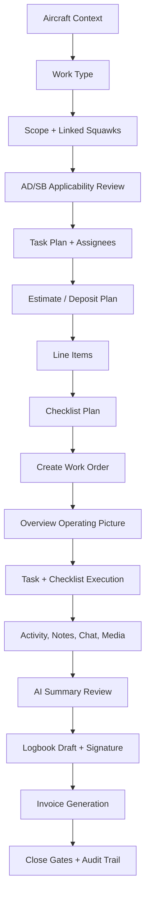

# Build Progress

## 2026-05-13 - Universal Work Order Creation and Execution UI

Scope: Work-order creation, work-order execution UI, estimate-to-work-order line planning, invoice/logbook linking, and handoff notes.

No-touch areas: RAG, document ingestion, embeddings, retrieval, citations, Ask, and document processing were intentionally left unchanged.

### Implemented

- Replaced the create work-order modal with the universal eight-step workflow:
  Aircraft -> Work Type -> Scope + Squawks -> AD/SB -> Tasks -> Estimate -> Checklist -> Review.
- Kept both entry paths:
  - From aircraft page: aircraft can be preselected.
  - From work-order list: aircraft selection is required first.
- Added pre-create context loading for open squawks, AD/SB applicability, and existing estimates.
- Attached existing estimate line items as planned work-order line items during work-order creation.
- Linked the selected estimate back to the created work order and marked it converted.
- Reworked work-order detail to start on an Overview tab with operating picture, progress, actual totals, owner approval state, and close readiness gates.
- Added task-card execution view derived from checklist sections, AD/SB items, line-item reconciliation, and closeout work.
- Refined the opened work-order execution workspace to match the universal spec:
  compact aircraft-first header, Overview panels for description/status/details/attachments/tasks/line items, Task & Checklist execution table with timer/activity rail, separated Activity/Chat/Notes tabs, Parts lifecycle tab, richer limited Owner View, and AI Summary with adjacent logbook/invoice closeout panels.
- Changed selected work-order navigation to a focused route: `/work-orders` keeps the searchable work-order picker, while `/work-orders/[id]` hides the internal picker and ops strip so Overview, Tasks, Checklist, Parts, AD/SB, Activity, Chat, Notes, AI Summary, Logbook, and Invoice use the full workspace.
- Kept the existing durable sources of truth: checklist rows, line items, activity/messages, AI summary, logbook, invoice, audit logs.
- Linked generated invoices back to `work_orders.linked_invoice_id`.
- Linked generated logbook drafts back to `work_orders.linked_logbook_entry_id`.
- Fixed work-order tab metadata to use `work_order_number` instead of the non-schema `wo_number`.
- Fixed AI work-plan route aliases so it reads `complaint` as `customer_complaint` and `parts_library.base_price`.

### Current Work-Order Flow

### Key Files

- `apps/web/components/work-orders/create-work-order-modal.tsx`
- `apps/web/app/api/work-orders/route.ts`
- `apps/web/app/(app)/work-orders/[id]/work-order-detail-client.tsx`
- `apps/web/app/(app)/work-orders/[id]/page.tsx`
- `apps/web/app/(app)/work-orders/layout.tsx`
- `apps/web/app/(app)/work-orders/work-orders-shell.tsx`
- `apps/web/app/api/invoices/route.ts`
- `apps/web/app/api/work-orders/[id]/ai-plan/route.ts`

### Remaining Gaps

- Dedicated persisted task records are not in the current schema. The UI derives task cards from checklist rows, line items, AD/SB rows, and closeout state.
- Checklist rows currently store completion, not full pass/fail/deferred/waived result state; the execution UI now exposes those columns visually, but the backing schema/API still needs persisted result status, finding, photo, and waiver fields.
- Activity and owner-chat panels are now separated in the UI, but immutable audit events and owner message persistence should be wired to dedicated records if the product needs more than the existing message/activity surfaces.
- Owner approvals and owner chat exist in the platform, but this pass did not add a new granular approval request builder inside every task card.
- Offline drafting is not implemented in this pass.
- The work-order graph index for this checkout is empty, so future agents should rebuild or refresh code-review-graph before relying on it.
