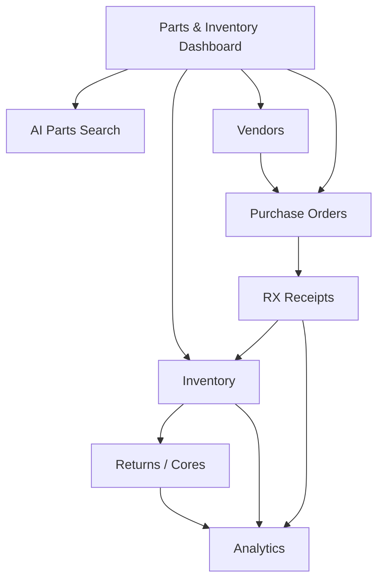
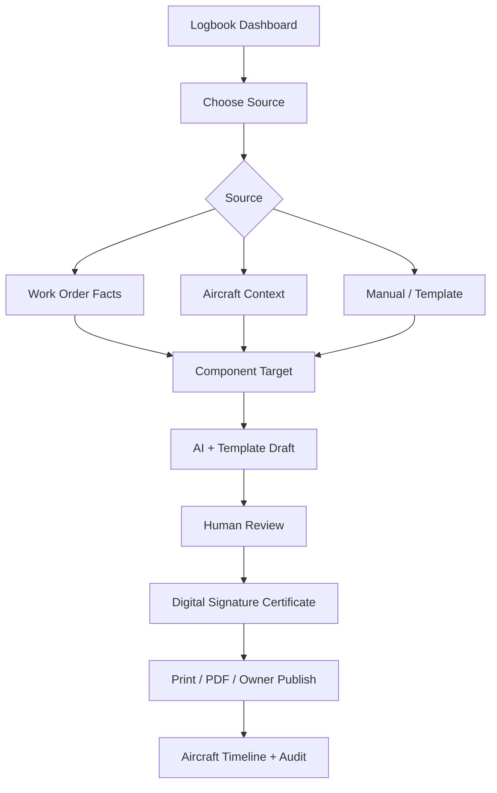
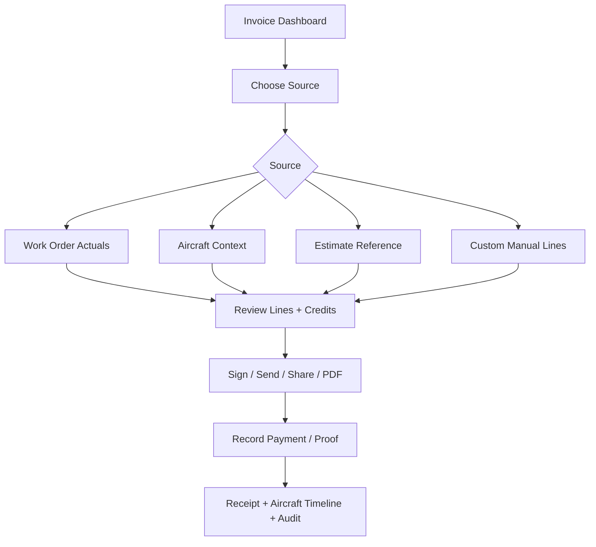
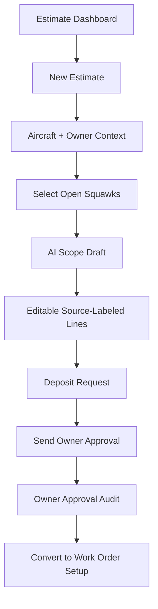
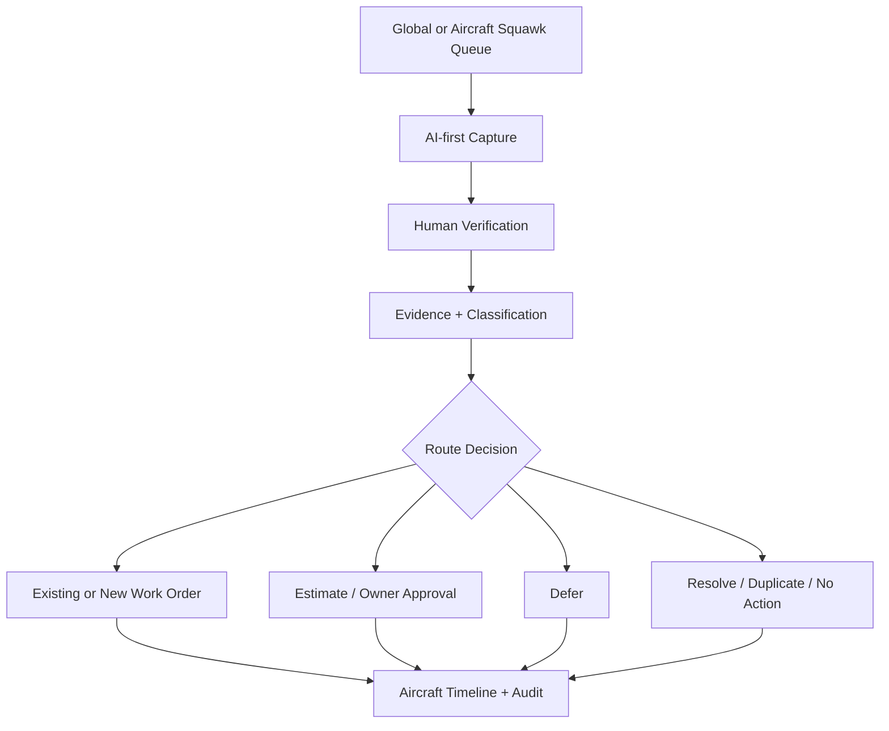
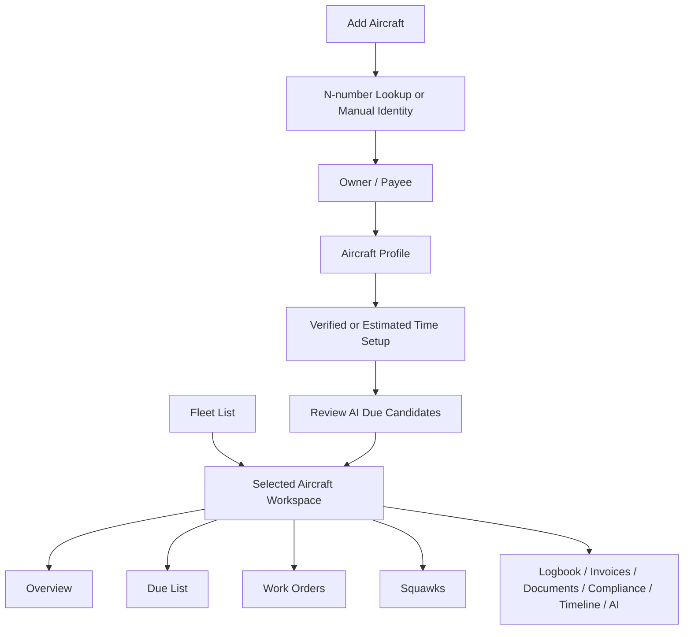
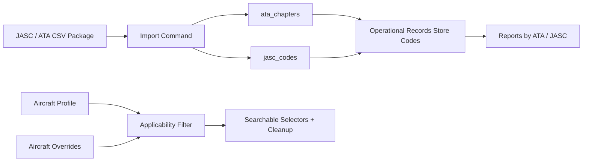
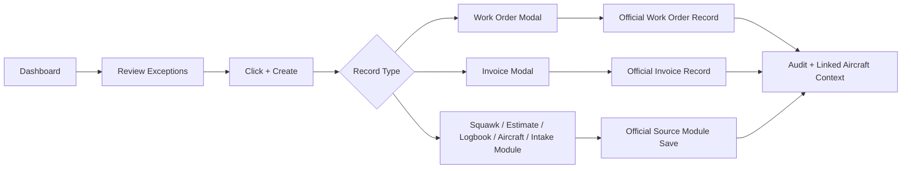
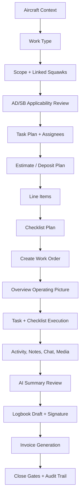

# Build Progress

## 2026-05-14 - Parts & Inventory Canonical Workspace

Scope: Implement the queued Parts & Inventory SOP as one routed workspace for dashboard, AI Parts Search, inventory, vendors, purchase orders, RX receipts, returns/cores, and analytics.

No-touch areas: The existing working AI Parts Search flow is preserved. The new AI Search tab reuses the current `/api/parts/search` and `/api/parts/click` component path instead of replacing it with a new mock flow. RAG, document retrieval, work-order actuals, estimates, invoices, logbook signing, and aircraft workspace ownership remain untouched.

### Implemented

- Added a canonical `/parts-inventory` module with child routes for dashboard, AI Parts Search, inventory, vendors, purchase orders, RX receipts, returns, and analytics.
- Updated shop navigation to show a single expanded `Parts & Inventory` parent with the locked child routes instead of disconnected flat Inventory, Vendors, and Purchase Orders entries.
- Redirected legacy `/parts`, `/vendors`, and `/purchase-orders` list pages into the canonical Parts & Inventory child screens while leaving existing detail/library routes intact.
- Added a source-of-truth migration for canonical part identity, saved/watchlist parts, inventory transactions, AI/vendor offers, search events, RX receipts, returns/cores/warranty, and analytics snapshots.
- Extended existing inventory, vendor, purchase order, and PO line tables with SOP metadata without replacing existing records.
- Added deterministic stock-status helper logic and a Parts & Inventory audit action endpoint.
- Built the new workspace shell with the locked dashboard metrics and child tabs while reusing the existing live AI Parts Search, Inventory, Vendors, and Purchase Orders components so current workflows are not disturbed.
- Added staged RX/returns workflow boards and analytics drilldown cards as the new child screens that did not already have equivalent live module components.

### Parts & Inventory Flow

### Key Files

- `supabase/migrations/20260514211325_parts_inventory_source_of_truth.sql`
- `apps/web/lib/parts-inventory/workflow.ts`
- `apps/web/app/api/parts-inventory/actions/route.ts`
- `apps/web/components/parts-inventory/parts-inventory-workspace.tsx`
- `apps/web/app/(app)/parts-inventory/_components/parts-inventory-page.tsx`
- `apps/web/app/(app)/parts-inventory/*/page.tsx`
- `apps/web/components/redesign/AppLayout.tsx`
- `apps/web/lib/nav/categories.ts`
- `apps/web/app/(app)/parts/page.tsx`
- `apps/web/app/(app)/vendors/page.tsx`
- `apps/web/app/(app)/purchase-orders/page.tsx`

### Verification

- Ran `git diff --check` for the Parts & Inventory workspace, routes, route redirects, navigation updates, helper, audit API, migration, and build-progress note.
- Verified `/parts-inventory/ai-parts-search` renders the existing `PartSearchPanel`, which still calls `/api/parts/search` and `/api/parts/click`.
- Node-based typecheck/build remains deferred because this worktree has stuck Node verifier processes in uninterruptible wait from earlier checks.

## 2026-05-14 - Logbook Entries Component-Specific Signed Records

Scope: Implement the queued Logbook Entries SOP as the human-signed maintenance record workflow. Work orders provide facts, templates/AI draft wording, and the certificated signer owns the final signed record.

No-touch areas: RAG, document retrieval, embeddings, citation behavior, invoice/payment truth, estimate approval truth, and work-order actual execution ownership were left intact. This pass extends logbook source mapping and signed-record controls without replacing source modules.

### Implemented

- Added logbook source-of-truth fields for target logbook, source type/id/context, source references, signer/certificate metadata, IA flag, revision chain, hashes, signature reason, AI review state, owner visibility, and print/publish timestamps.
- Expanded logbook statuses to support ready for review, ready to sign, printed unsigned, published to owner, superseded, voided, and legacy final/amended states.
- Added `logbook_source_bundles`, `logbook_entry_revisions`, and `logbook_output_events` with RLS and authenticated grants.
- Extended `signature_certificates` for logbook-specific identity, certificate, MFA, source-reference, entry hash, PDF hash, and previous revision hash fields.
- Reworked logbook create API so work-order sources auto-map aircraft, work-order number, labor/parts lines, checklist items, AD/SB references, parts used, source bundle, audit logs, and aircraft timeline events.
- Reworked logbook update API to block silent edits to signed/published entries and create explicit revisions when requested.
- Reworked sign API to create immutable signature certificate rows, write hashes, warn on missing official time unless confirmed, store signature audit metadata, and write audit/timeline events.
- Replaced the old list-only Logbook page with a DB-backed workflow board for dashboard queue, source choice, work-order mapping, component targets, AI/template draft review, signature certificate model, and output rules.
- Updated logbook detail to show source bundle, revision/AI/owner state, signature certificate data, hashes, print/publish actions, and guarded signing.

### Logbook Flow

### Key Files

- `supabase/migrations/20260514195159_logbook_entries_signed_records.sql`
- `apps/web/lib/logbook/constants.ts`
- `apps/web/lib/logbook/workflow.ts`
- `apps/web/app/api/logbook-entries/route.ts`
- `apps/web/app/api/logbook-entries/[id]/route.ts`
- `apps/web/app/api/logbook-entries/[id]/sign/route.ts`
- `apps/web/app/(app)/logbook-entries/page.tsx`
- `apps/web/app/(app)/logbook-entries/[id]/page.tsx`
- `apps/web/components/logbook/logbook-workflow-board.tsx`
- `apps/web/components/logbook/logbook-entry-detail.tsx`

### Verification

- Ran `git diff --check` for the logbook migration, logbook helpers, logbook APIs, logbook pages/components, and build-progress note.
- Node-based typecheck/build remains deferred because this worktree has stuck Node verifier processes in uninterruptible wait from earlier checks.

## 2026-05-14 - Invoices / Payments Aircraft-Linked Billing Workflow

Scope: Implement the queued Invoices / Payments SOP as the billing source of truth. Invoices own billed charges and payment state; work orders remain actual-work truth; estimates remain planned commercial scope; deposits apply as credits/payments rather than revenue lines.

No-touch areas: RAG, document retrieval, embeddings, citation behavior, work-order actual completion logic, and estimate approval truth were left intact. This pass extends invoices/payments and reads source records without replacing their ownership.

### Implemented

- Added invoice source-of-truth fields for source type/id, estimate source, payee, fees, deposit credit total, payment status, signature metadata, invoice version/hash, manual bypass reason, and source context.
- Expanded invoice statuses to support ready to send, viewed, due, refunded, and written off while preserving older draft/sent/pending/paid/void/writeoff states.
- Added invoice-line source fields: source type/id/label, approved-for-billing, billable, owner visibility, tax category, linked task/part/labor references, and wider line types for supply, discount, adjustment, and deposit credit.
- Added billing review fields to work-order lines so invoice generation can skip lines not approved for billing.
- Expanded payments for card/Stripe, Zelle proof, cash, check, ACH, manual, deposit credits, verification state, proof attachment, receipt metadata, and aircraft/owner linkage.
- Added `payment_proofs`, `invoice_receipts`, `invoice_share_events`, and `invoice_versions` with RLS and authenticated grants.
- Reworked invoice create API into source-aware builders for work order, aircraft, estimate, and custom/manual invoices.
- Work-order invoice creation now pulls approved billable actual lines and preserves source labels such as `WO Actual`, `Installed Part`, `Outside Service`, and `Shop Rule`.
- Estimate invoice creation carries estimate lines as `Estimate Reference` and marks them as requiring billing review.
- Deposit payments from approved estimates are auto-applied as invoice payment credits and linked back to the invoice.
- Payment recording now supports verification requirements, Zelle proof metadata, receipt creation, audit logs, and aircraft timeline events.
- Send/PDF routes now use payee context, enforce aircraft/contact before send, record share/export events, and avoid exposing internal notes.
- Replaced the old client-only invoice screen with a DB-backed Invoices & Payments workflow board matching the SOP flow and source-selection UI.
- Updated invoice detail to show source context, payment status, deposit credits, version, source-labeled invoice lines, payment history, and closeout actions.

### Invoice Flow

### Key Files

- `supabase/migrations/20260514173512_invoices_payments_source_of_truth.sql`
- `apps/web/lib/invoices/workflow.ts`
- `apps/web/app/api/invoices/route.ts`
- `apps/web/app/api/invoices/[id]/route.ts`
- `apps/web/app/api/invoices/[id]/payments/route.ts`
- `apps/web/app/api/invoices/[id]/lines/route.ts`
- `apps/web/app/api/invoices/[id]/lines/[lineId]/route.ts`
- `apps/web/app/api/invoices/[id]/send/route.ts`
- `apps/web/app/api/invoices/[id]/pdf/route.ts`
- `apps/web/app/(app)/invoices/page.tsx`
- `apps/web/app/(app)/invoices/[id]/page.tsx`
- `apps/web/app/(app)/invoices/[id]/invoice-detail.tsx`
- `apps/web/components/invoices/invoice-workflow-board.tsx`

### Verification

- Ran `git diff --check` for the invoice API, invoice pages/components, invoice helper, and invoice migration.
- Node-based typecheck/build was not run in this pass because this worktree has stuck Node verifier processes in uninterruptible wait from earlier checks.

## 2026-05-14 - Estimates / Deposits / Owner Approvals Workflow

Scope: Implement the queued Estimates SOP as the aircraft-linked commercial planning workflow. Estimate owns planned scope, owner approval, terms, and deposit request; work orders remain execution truth and invoices use reviewed actuals.

No-touch areas: RAG, document retrieval, embeddings, citation behavior, and work-order actual reconciliation logic were left intact. This pass extends estimates and estimate line items without replacing work-order or invoice source-of-truth behavior.

### Implemented

- Added estimate workflow fields for source context, estimate type, price book/tax profile placeholders, terms, deposit required/amount/status, approval status, approved identity/time, converted work-order reference, owner approval summary, and AI review state.
- Added line source fields on estimate lines: source type/id/label, billable, owner-visible, inventory status, tax code, inventory link, and amount snapshot.
- Added `estimate_ai_drafts`, `owner_approvals`, `deposit_payments`, and `estimate_revisions`.
- Expanded estimate statuses to support internal review, ready to send, viewed, owner question, awaiting approval, awaiting deposit, deposit paid, declined, expired, superseded, converted to work order, and archived while preserving older statuses.
- Updated estimate create API to enforce aircraft/owner before official delivery, persist AI draft metadata, source labels, deposit metadata, audit logs, and aircraft timeline events.
- Updated estimate send and approval APIs to set approval/deposit states and record owner approval/decline/question audit records.
- Preserved estimate line source metadata when approved estimates create planned work-order lines, including source labels, estimate-line linkage, billable/owner-visible flags, and taxonomy fields.
- Added `/estimates/new` with an aircraft-linked creation workspace: auto-filled aircraft/owner context, open squawk pull-in, prompt-driven draft line items, editable source-labeled lines, deposit setup, owner preview, and owner-send path.
- Enabled the global Estimates `New Estimate` button.

### Estimate Flow

### Key Files

- `supabase/migrations/20260514165207_estimates_deposits_owner_approvals.sql`
- `apps/web/lib/estimates/workflow.ts`
- `apps/web/app/api/estimates/route.ts`
- `apps/web/app/api/estimates/[id]/route.ts`
- `apps/web/app/api/estimates/[id]/send/route.ts`
- `apps/web/app/api/estimates/[id]/approval/route.ts`
- `apps/web/app/(app)/estimates/new/page.tsx`
- `apps/web/components/estimates/estimate-create-workspace.tsx`
- `apps/web/app/(app)/estimates/estimates-list-view.tsx`
- `apps/web/app/(app)/estimates/[id]/estimate-detail.tsx`

## 2026-05-14 - Squawks / Discrepancy Intake Source of Truth

Scope: Implement the queued Squawks SOP as an aircraft-first discrepancy intake, evidence, AI draft, routing, owner visibility, resolution, and audit workflow. Estimates / Deposits / Owner Approvals was implemented in the following pass.

No-touch areas: RAG, document retrieval, embeddings, citation behavior, and the Aircraft Workspace v2 source-of-truth tables were left intact. This pass extends squawk records and uses existing aircraft, estimate, work-order, audit, timeline, and taxonomy integrations where available.

### Implemented

- Added `squawk_evidence`, `squawk_ai_drafts`, `squawk_routes`, `squawk_status_history`, `squawk_owner_visibility`, and `squawk_resolutions`.
- Extended existing `squawks` with owner visibility, category, created/reported/verified user fields, route links, closure fields, duplicate linkage, and SOP-compatible status/severity/source values.
- Preserved existing squawk rows and older enum values while enabling the fuller SOP lifecycle.
- Upgraded squawk create/update APIs to require aircraft before official save, store human verification state, persist AI drafts/evidence metadata, write audit logs, project aircraft timeline events, and require reasons for material edits, deferrals, and closures.
- Added dedicated endpoints for squawk evidence, AI draft persistence, and routing to work order, estimate, owner approval, deferral, duplicate, no-action, or closure.
- Changed hard delete behavior to a 409 response with an audit-preserving close/archive instruction.
- Added a global `/squawks` queue and replaced the aircraft-specific squawks tab with the same shared workspace in aircraft-locked mode.
- Updated mechanic navigation so Squawks opens the global queue instead of the legacy mechanic tab.

### Squawk Flow

### Key Files

- `supabase/migrations/20260514152339_squawks_discrepancy_intake.sql`
- `apps/web/lib/squawks/workflow.ts`
- `apps/web/app/api/squawks/route.ts`
- `apps/web/app/api/squawks/[id]/route.ts`
- `apps/web/app/api/squawks/[id]/route/route.ts`
- `apps/web/app/api/squawks/[id]/evidence/route.ts`
- `apps/web/app/api/squawks/[id]/ai-draft/route.ts`
- `apps/web/app/(app)/squawks/page.tsx`
- `apps/web/components/squawks/squawks-workspace.tsx`
- `apps/web/app/(app)/aircraft/[id]/squawks/page.tsx`
- `apps/web/components/redesign/AppLayout.tsx`

## 2026-05-14 - Aircraft Workspace v2

Scope: Implement the aircraft module as the aircraft-first workspace from the detailed SOP: `/aircraft` is the searchable fleet list, `/aircraft/new` is N-number onboarding, and `/aircraft/[id]` is the selected-aircraft command center.

No-touch areas: RAG, document retrieval, citation behavior, privacy/RLS outside the aircraft workspace tables, and the queued Squawks SOP were intentionally left unchanged. The aircraft workspace consumes existing squawk records, but the dedicated AI-first Squawks module is queued for the next pass.

### Implemented

- Replaced the Aircraft list with a searchable fleet workspace showing generated silhouettes or uploaded photos, verified Tach/Hobbs/total time, status, base, owner/operator context, and risk chips.
- Replaced the selected aircraft page with a focused command-center workspace with back navigation, aircraft identity header, generated silhouette default image, verified-vs-estimated time display, owner/payee context, operation/program details, and aircraft-scoped action menu.
- Completed the aircraft-scoped action menu with Edit Aircraft, Update Times, Create Due Item, Generate AI Due List, Create Squawk, Create Estimate, Create Work Order, Create Invoice, Create Logbook Entry, Upload Document, Share Owner View, Export Aircraft Package, Ground Aircraft, and Archive Aircraft.
- Passed source context into launched module links with `source_context`, `aircraft_id`, `tail_number`, `owner_id`, and `launch_route` query data where those flows are still handled by existing module pages.
- Added full aircraft-scoped tabs: Overview, Due List, Work Orders, Squawks, Logbook, Invoices, Documents, Compliance, Timeline, and AI Assistant.
- Added N-number onboarding with steps for registry lookup/manual fallback, owner/payee separation, aircraft profile, time source setup, optional ADS-B estimate fallback, AI due-list review, and final create.
- Added generated aircraft silhouette support so onboarding does not require photo upload and does not depend on external image scraping.
- Added aircraft workspace schema migration with aircraft profile fields, media, time ledger, current time snapshot, due items, timeline events, and AI suggestions.
- Added aircraft APIs for workspace aggregation, time ledger updates, aircraft due items, and reviewable AI due-list suggestions.
- Preserved verified and estimated time separation: ADS-B values are stored as estimates and do not overwrite verified Tach/Hobbs/total time.
- Added aircraft timeline/audit writes for create/update, time entry, due item creation, and AI due-list generation where those flows save official aircraft records.
- Kept ATA/JASC readable labeling available in aircraft due, compliance, and logbook surfaces through the taxonomy lookup helpers.

### Aircraft Workspace Flow

### Key Files

- `supabase/migrations/20260514131428_aircraft_workspace_v2.sql`
- `apps/web/app/(app)/aircraft/page.tsx`
- `apps/web/app/(app)/aircraft/new/page.tsx`
- `apps/web/app/(app)/aircraft/[id]/page.tsx`
- `apps/web/components/aircraft/aircraft-workspace-list.tsx`
- `apps/web/components/aircraft/aircraft-workspace-detail.tsx`
- `apps/web/components/aircraft/aircraft-silhouette.tsx`
- `apps/web/lib/aircraft/workspace.ts`
- `apps/web/app/api/aircraft/[id]/workspace/route.ts`
- `apps/web/app/api/aircraft/[id]/time/route.ts`
- `apps/web/app/api/aircraft/[id]/due-items/route.ts`
- `apps/web/app/api/aircraft/[id]/ai-due-list/route.ts`
- `apps/web/app/api/aircraft/route.ts`
- `apps/web/app/api/aircraft/[id]/route.ts`

### Verification

- Passed targeted ESLint for the aircraft workspace UI and aircraft workspace APIs.
- Ran repo-wide TypeScript with a larger Node heap; aircraft-related errors were fixed, but the repo still has unrelated existing failures in persona/billing/test/dashboard/taxonomy/trash areas.
- Started the local Next dev server and confirmed it boots, but `/aircraft` cannot render in this worktree until `NEXT_PUBLIC_SUPABASE_URL` and `NEXT_PUBLIC_SUPABASE_ANON_KEY` are present locally. The current local env only exposes `VERCEL_TOKEN`.

### Remaining Gaps

- FAA registry lookup depends on the existing `/api/aircraft/faa-lookup` behavior and still needs live source verification in a deployed environment.
- The selected aircraft workspace links to existing module routes for squawks, estimates, invoices, logbook entries, and documents; those modules still need their own SOP-specific deep flows where not already implemented.
- Due-list recurrence closeout from work-order completion is represented by data structures and APIs but not fully automated across every downstream work-order close path.
- Mobile/iPad polish is responsive and usable, but dedicated mobile bottom-sheet actions and offline onboarding drafts are not implemented in this pass.
- Owner-facing aircraft projection remains a tab/link target expectation; this pass did not add a separate owner portal aircraft workspace.

## 2026-05-14 - JASC / ATA Maintenance Taxonomy Foundation

Scope: Import the FAA-derived JASC / ATA package as the shared maintenance classification source of truth and wire nullable taxonomy fields into operational records without replacing existing business categories.

No-touch areas: RAG, document ingestion, embeddings, retrieval, citations, Ask answer generation, and aircraft time verification logic were intentionally left unchanged. ADS-B/estimated time remains separate from taxonomy classification.

### Implemented

- Added the JASC / ATA import source files under `apps/web/data/jasc-ata`.
- Added Supabase migration `120_jasc_ata_maintenance_taxonomy.sql` with:
  `ata_chapters`, `jasc_codes`, `taxonomy_import_runs`, `aircraft_taxonomy_applicability`, and `work_order_jasc_references`.
- Added nullable ATA/JASC classification fields to compliance due items, continued/future items, work orders, work-order lines, checklist items, estimate lines, invoice lines, inventory parts, parts library records, squawks, and logbook entries.
- Preserved existing business categories and work-order service types; ATA/JASC answers system/component, not why the work exists.
- Added repeatable import commands:
  `pnpm import:jasc-ata` and `pnpm seed:taxonomy`.
- Added taxonomy APIs for ATA, JASC, search, aircraft-specific applicable taxonomy, applicability overrides, unclassified cleanup, and taxonomy reporting.
- Wired API create/update paths to normalize ATA/JASC strings, preserve leading zeros, derive ATA from JASC when needed, and keep squawk suggested codes separate from confirmed codes.
- Added Settings -> Taxonomy admin page with reference counts, search, aircraft applicability links, and unclassified cleanup counts.

### Taxonomy Flow

### Key Files

- `supabase/migrations/120_jasc_ata_maintenance_taxonomy.sql`
- `apps/web/scripts/import-jasc-ata.ts`
- `apps/web/lib/taxonomy/format.ts`
- `apps/web/lib/taxonomy/queries.ts`
- `apps/web/app/api/taxonomy/*`
- `apps/web/app/api/aircraft/[id]/taxonomy/*`
- `apps/web/app/api/reports/taxonomy/route.ts`
- `apps/web/app/(app)/settings/taxonomy/page.tsx`

## 2026-05-14 - Dashboard Shop Command Center and Universal Create Launcher

Scope: Rename the shop AI command center concept into the Dashboard, implement the dashboard SOP surface, and wire the universal create launcher to existing official module flows.

No-touch areas: RAG, document ingestion, embeddings, retrieval, citations, Ask answer generation, and document processing were intentionally left unchanged.

### Implemented

- Replaced the legacy analytics-style Dashboard component with the SOP Dashboard - Shop Command Center:
  Active Work Orders, Estimates Waiting, Owner Approvals, Ready to Invoice, Today's Action Queue, Aircraft Risk Board, Revenue & Billing Snapshot, My Assignments, and Dashboard rule footer.
- Added the universal `+ Create` launcher on Dashboard with:
  Squawk / Discrepancy, Estimate / Quote, Work Order, Invoice, Logbook Entry, Aircraft, and Upload / AI Intake.
- Preserved the SOP write boundary:
  Dashboard shows exceptions and shortcuts only; official records still save inside Aircraft, Work Orders, Estimates, Invoices, Logbook, Intake, and source modules.
- Wired Dashboard Work Order creation to the existing universal `CreateWorkOrderModal`.
- Wired Dashboard Invoice creation to the existing `CreateInvoiceModal`.
- Wired non-modal create options to their module entry points instead of creating orphan records.
- Changed the shop persona home route from `/workflow` to `/dashboard`.
- Rewired the shop sidebar so the former AI Command Center entry becomes `Dashboard` at `/dashboard`.

### Dashboard + Create Flow

### Key Files

- `apps/web/components/redesign/Dashboard.tsx`
- `apps/web/components/redesign/AppLayout.tsx`
- `apps/web/lib/persona/config.ts`

## 2026-05-13 - Universal Work Order Creation and Execution UI

Scope: Work-order creation, work-order execution UI, estimate-to-work-order line planning, invoice/logbook linking, and handoff notes.

No-touch areas: RAG, document ingestion, embeddings, retrieval, citations, Ask, and document processing were intentionally left unchanged.

### Implemented

- Replaced the create work-order modal with the universal eight-step workflow:
  Aircraft -> Work Type -> Scope + Squawks -> AD/SB -> Tasks -> Estimate -> Checklist -> Review.
- Kept both entry paths:
  - From aircraft page: aircraft can be preselected.
  - From work-order list: aircraft selection is required first.
- Added pre-create context loading for open squawks, AD/SB applicability, and existing estimates.
- Attached existing estimate line items as planned work-order line items during work-order creation.
- Linked the selected estimate back to the created work order and marked it converted.
- Reworked work-order detail to start on an Overview tab with operating picture, progress, actual totals, owner approval state, and close readiness gates.
- Added task-card execution view derived from checklist sections, AD/SB items, line-item reconciliation, and closeout work.
- Refined the opened work-order execution workspace to match the universal spec:
  compact aircraft-first header, Overview panels for description/status/details/attachments/tasks/line items, Task & Checklist execution table with timer/activity rail, separated Activity/Chat/Notes tabs, Parts lifecycle tab, richer limited Owner View, and AI Summary with adjacent logbook/invoice closeout panels.
- Changed selected work-order navigation to a focused route: `/work-orders` keeps the searchable work-order picker, while `/work-orders/[id]` hides the internal picker and ops strip so Overview, Tasks, Checklist, Parts, AD/SB, Activity, Chat, Notes, AI Summary, Logbook, and Invoice use the full workspace.
- Kept the existing durable sources of truth: checklist rows, line items, activity/messages, AI summary, logbook, invoice, audit logs.
- Linked generated invoices back to `work_orders.linked_invoice_id`.
- Linked generated logbook drafts back to `work_orders.linked_logbook_entry_id`.
- Fixed work-order tab metadata to use `work_order_number` instead of the non-schema `wo_number`.
- Fixed AI work-plan route aliases so it reads `complaint` as `customer_complaint` and `parts_library.base_price`.

### Current Work-Order Flow

### Key Files

- `apps/web/components/work-orders/create-work-order-modal.tsx`
- `apps/web/app/api/work-orders/route.ts`
- `apps/web/app/(app)/work-orders/[id]/work-order-detail-client.tsx`
- `apps/web/app/(app)/work-orders/[id]/page.tsx`
- `apps/web/app/(app)/work-orders/layout.tsx`
- `apps/web/app/(app)/work-orders/work-orders-shell.tsx`
- `apps/web/app/api/invoices/route.ts`
- `apps/web/app/api/work-orders/[id]/ai-plan/route.ts`

### Remaining Gaps

- Dedicated persisted task records are not in the current schema. The UI derives task cards from checklist rows, line items, AD/SB rows, and closeout state.
- Checklist rows currently store completion, not full pass/fail/deferred/waived result state; the execution UI now exposes those columns visually, but the backing schema/API still needs persisted result status, finding, photo, and waiver fields.
- Activity and owner-chat panels are now separated in the UI, but immutable audit events and owner message persistence should be wired to dedicated records if the product needs more than the existing message/activity surfaces.
- Owner approvals and owner chat exist in the platform, but this pass did not add a new granular approval request builder inside every task card.
- Offline drafting is not implemented in this pass.
- The work-order graph index for this checkout is empty, so future agents should rebuild or refresh code-review-graph before relying on it.
