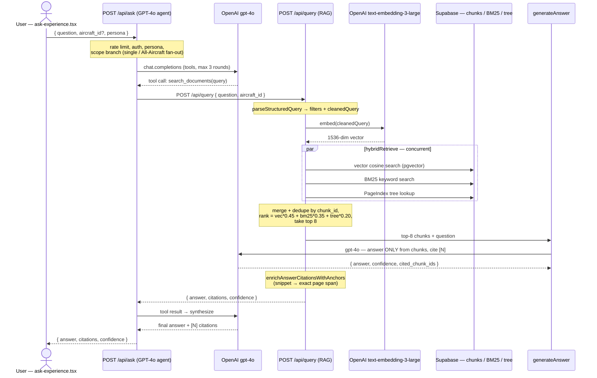

# Ask Logbook AI — query flow

A developer reference for what happens, end to end, when a user submits a
question in **Ask Logbook AI** ("Ask Your Aircraft").

## TL;DR — "is it string matching or vectors?"

**Neither alone — it is a hybrid.** The user's question is used in *two* forms
at the same time:

1. **As a 1536-dimension embedding vector** → semantic similarity search
   (matches meaning, handles paraphrase).
2. **As raw text / tokens** → BM25 keyword search + PageIndex tree-label
   matching (matches exact strings — part numbers, AD numbers, serials).

Three retrievers run **concurrently**, their results are merged and
weight-ranked, and the top 8 chunks are handed to the LLM to answer from.

---

## Prerequisite — what is indexed *before* any query (ingestion)

Retrieval can only find what was indexed at upload time. When a document is
ingested: OCR (Google Document AI) → text split into **chunks** → each chunk
embedded → stored in `document_chunks` (`chunk_text`, `embedding` pgvector,
`page_number`, `section_title`, `document_id`, `aircraft_id`, `metadata_json`).
Two more per-aircraft indexes are then built:

| Index | Where it lives | Used for |
|---|---|---|
| Vector | `document_chunks.embedding` (pgvector) | semantic similarity |
| BM25 keyword | `rag-indexes/<aircraftId>/bm25.json` (Supabase Storage) | exact strings |
| PageIndex tree | `page_tree_nodes` table | document-structure lookup |

---

## Sequence diagram



---

## Stage 0 — the UI

`components/ask/ask-experience.tsx`. The user types a question, picks
**Owner / Mechanic** mode and an aircraft (or **"All Aircraft"**), and on
submit `POST`s `/api/ask`:

```
{ question, aircraft_id (undefined if "All Aircraft"), persona, conversation_history }
```

## Stage 1 — `/api/ask` — the GPT-4o command agent

`app/api/ask/route.ts` → `POST`:

1. **Rate limit** — 15 requests / minute / IP.
2. **Auth** — `resolveRequestOrgContext(req)` resolves org membership from the
   session cookie (401 / 403 otherwise).
3. **Persona** — Owner mode exposes only the `search_documents` tool; Mechanic
   mode exposes the full toolset (search_documents, search_logbook,
   search_parts, create_logbook_entry, generate_checklist).
4. **Scope branch:**
   - **Single aircraft** → `resolveCanonicalAircraftId` (de-dupes tail
     numbers) → `runAskAgent` once.
   - **All Aircraft** → `classifyAskQuestion()` (`lib/ask/question-classifier.ts`)
     → `org_wide` (one pass) or `per_aircraft` (fan out — `runAskAgent` per
     aircraft, in parallel, capped at 10, then one assembled per-aircraft
     answer).

## Stage 2 — `runAskAgent` — the tool-calling loop

- Builds messages: persona system prompt (incl. scope discipline) +
  conversation history + the question.
- Loops **max 3 rounds** calling `gpt-4o` (`temp 0.3`, `tool_choice: 'auto'`):
  - **No tool call** → that response is the final answer.
  - **Tool call** → `dispatchTool()` runs it, the result is appended as a
    tool message, loop again.
- The Q&A tool — **`search_documents`** — calls **`/api/query`** internally
  (`callInternal`, forwarding the caller's cookie). That is where retrieval
  happens ↓

## Stage 3 — `/api/query` — the RAG pipeline (the core)

`app/api/query/route.ts` → `POST`:

1. **Auth + quota** — checks the org's monthly query quota (429 if exceeded).
2. **`parseStructuredQuery`** (`lib/rag/query-parser.ts`) — normalizes the
   question and extracts structured filters: doc-type filter, date ranges, a
   `cleanedQuery` string, resolved aircraft id.
3. **Embed** — `generateEmbeddings([{ text: cleanedQuery }])` → OpenAI
   **`text-embedding-3-large`**, a **1536-float vector**. *(The string becomes
   a vector here.)*
4. **`hybridRetrieve` — three retrievers run CONCURRENTLY (`Promise.all`):**
   - **Vector** — `retrieveChunks` (`lib/rag/retrieval.ts`): pgvector
     **cosine similarity** of the query vector vs every chunk's `embedding`,
     scoped by org + aircraft + doc-type filter.
   - **BM25** — `searchBm25` (`lib/rag/bm25-index.ts`): term-frequency keyword
     scoring over the per-aircraft JSON index. Catches exact strings.
   - **Tree** — `selectTreeChunkIds`: matches query terms against
     `page_tree_nodes` labels/summaries.
   - **Merge + dedupe** by `chunk_id` (BM25/tree-only hits hydrated from
     `document_chunks`); **rank** `score = vector*0.45 + bm25*0.35 + tree*0.20`
     (each normalized 0–1) → **top 8 chunks**. Falls back to vector-only on
     any failure.
5. **`generateAnswer`** (`lib/rag/generation.ts`):
   - Builds a context block — the 8 chunks numbered `[1]…[8]` with their text.
   - Calls `gpt-4o` with a strict prompt: *answer only from these chunks, cite
     every claim with `[N]`, say "insufficient evidence" if not present*.
     Returns JSON `{ answer, confidence, confidence_score, cited_chunk_ids }`.
   - Post-processing: inline `[N]` markers are the source of truth for which
     chunk each citation points at; confidence capped to `low` if zero
     citations; `confidence_score` validated + clamped to `[0,1]`; empty
     retrieval → immediate `insufficient_evidence`.
6. **`enrichAnswerCitationsWithAnchors`** (`lib/rag/citation-anchors.ts`) —
   maps each citation's quoted snippet to an exact text span / bounding region
   on the source PDF page, so the UI can highlight the precise passage.
7. **Persist** — inserts a `queries` row + `citations` rows, increments the
   org query counter, and fire-and-forget logs to `rag_query_log`.
8. **Returns** `{ answer, confidence, confidence_score, citations[] }` (each
   citation carries document, page number, and text anchor).

## Stage 4 — back up the stack

`/api/query`'s result returns to `dispatchTool` → the GPT-4o agent in
`runAskAgent` receives it as a tool message → synthesizes the user-facing
answer with `[N]` citations. For an All-Aircraft `per_aircraft` question, the
per-aircraft results are assembled into one answer (one line per tail number,
overall confidence = the minimum across aircraft, tail-labelled citations).

## Stage 5 — UI render

`ask-experience.tsx` renders the answer, the `[N]` citation chips, and the
confidence badge. Clicking a citation opens the **Source Preview** panel at the
exact cited PDF page using the bounding-region anchors.

---

## Important nuance — two retrieval entry points

Do not confuse these:

- **`/api/query`** (the Ask flow above) — **always** runs all three retrievers
  (`hybridRetrieve`); no strategy router.
- **`runIntelligenceQuery`** (`lib/rag/intelligence-query.ts`, used by the 10
  Aircraft Intelligence modules) — uses a **strategy router**
  (`routeQuery` / `routeQueryAsync`, `lib/rag/query-router.ts`) that decides
  per query which indexes to consult.

---

## File / function reference

| Concern | File | Key symbol |
|---|---|---|
| Ask UI | `components/ask/ask-experience.tsx` | — |
| Command agent | `app/api/ask/route.ts` | `POST`, `runAskAgent`, `dispatchTool` |
| All-Aircraft classifier | `lib/ask/question-classifier.ts` | `classifyAskQuestion` |
| RAG endpoint | `app/api/query/route.ts` | `POST`, `hybridRetrieve` |
| Query parsing | `lib/rag/query-parser.ts` | `parseStructuredQuery` |
| Embeddings | `lib/openai/embeddings.ts` | `generateEmbeddings` |
| Vector retrieval | `lib/rag/retrieval.ts` | `retrieveChunks` |
| BM25 keyword index | `lib/rag/bm25-index.ts` | `searchBm25`, `buildBm25Index` |
| PageIndex tree | `lib/rag/tree-builder.ts`, `page_tree_nodes` | `buildDocumentTree` |
| Answer generation | `lib/rag/generation.ts` | `generateAnswer` |
| Citation anchoring | `lib/rag/citation-anchors.ts` | `enrichAnswerCitationsWithAnchors` |
| Strategy router (Intelligence only) | `lib/rag/query-router.ts` | `routeQuery`, `routeQueryAsync` |
| Query feedback log | `lib/rag/feedback.ts`, `rag_query_log` | `logQueryResult` |
