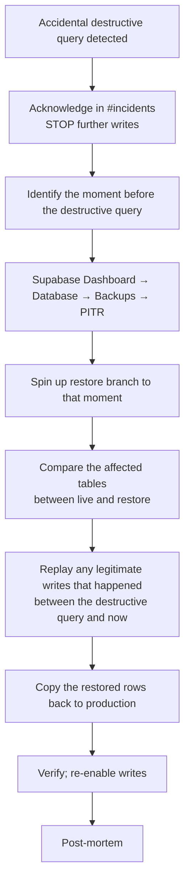

# myaircraft.us — Disaster Recovery Runbook

**Last updated:** 2026-05-21 · **Owner:** on-call engineer · **Audience:** on-call + leadership + SOC2 auditor

> Referenced from **SOP-13 §14 Backup & Disaster Recovery**. This runbook is the procedural detail behind the RTO/RPO commitments declared in SOP-13. The incident-response-runbook handles the "is on fire" phase; this runbook handles the "recover from a recoverable state" phase.

---

## 1. Recovery targets

| Metric | Target | Notes |
|---|---|---|
| **RTO** (Recovery Time Objective) | 4 hours | Service restored within 4h of incident declaration |
| **RPO** (Recovery Point Objective) | 5 minutes | At most 5 min of data loss in the worst recoverable scenario |
| Backup frequency | Daily (Supabase automated) + continuous PITR | |
| Backup retention | 7 days (Supabase Pro plan) | Longer-term archive deferred |
| Cross-region failover | NOT configured (single region: us-east-2) | Acknowledged limitation |

---

## 2. Backup inventory

### 2.1 Supabase database

- **Automated daily backups** stored encrypted by Supabase.
- **Point-in-time recovery (PITR)** enabled — restore to any moment in the past 7 days at ~2-minute granularity.
- Access: Supabase dashboard → Database → Backups.

### 2.2 Supabase Storage

- File buckets: `documents`, `scanner-captures`, `avatars`, planned `page-images-cache`.
- Per-object versioning: ENABLED on `documents` (the critical bucket).
- Replication: Supabase manages at the S3 layer.
- Access: Supabase dashboard → Storage.

### 2.3 Vercel

- Vercel does not require backups — code is in GitHub (`myaircraftus/claude`).
- Every deployment is preserved indefinitely on Vercel as a rollback target.
- Environment variables are also versioned by Vercel (planned for verification).

### 2.4 GitHub

- The canonical source-of-truth for code.
- Branch protection on `main` (planned).
- All PRs reviewed by Andy before merge.

---

## 3. Recovery scenarios

### 3.1 Accidental data deletion

**Scenario:** an admin runs a destructive SQL statement (`DELETE FROM work_orders` without a WHERE clause).

#### Steps

1. **Stop writes** — Vercel environment variable `READ_ONLY=true` (planned) OR temporarily disable the affected routes by feature flag.
2. **Identify the exact moment** of the destructive query — read the audit log or Supabase query logs.
3. **Open Supabase Branches** (Supabase's PITR feature) and create a branch from that moment minus 30 seconds.
4. **Diff** the affected tables between production and the branch.
5. **Restore** the missing rows via INSERTs from the branch.
6. **Re-enable writes** by flipping `READ_ONLY=false`.
7. **Audit** — write a post-mortem; identify how the destructive query was even possible.

### 3.2 Supabase region outage

**Scenario:** us-east-2 has a multi-hour outage.

Current posture: **we wait it out**. We do not have a cross-region failover. This is an acknowledged single point of failure.

Mitigations during the outage:

1. Acknowledge in `#incidents`; communicate to customers via the status channel.
2. Verify the issue is on Supabase's status page (not ours).
3. If the outage exceeds 2 hours, post a customer email with expected restore time (from Supabase's communications).
4. Once Supabase is restored, verify our app reconnects automatically (it does — no special action needed).

**Planned mitigation (NOT yet built):** read-replica in a second region + failover playbook. Tracked in SOP-13 §17 known technical debt.

### 3.3 Vercel outage

**Scenario:** Vercel platform issue.

1. Verify on status.vercel.com.
2. Customer communication.
3. Wait for Vercel.
4. Vercel SLA: 99.99% historically; outages are rare and short.

No special action — Vercel manages its own redundancy. The app comes back when Vercel comes back.

### 3.4 Critical bug in production

**Scenario:** a feature ships that breaks data integrity (e.g., a bug that writes wrong invoice totals to the database).

1. **Quarantine** — disable the buggy route immediately (feature flag OR Vercel rollback).
2. **Identify** the affected rows by SQL — `WHERE updated_at > '<deploy_time>' AND <invariant_violated>`.
3. **Restore the affected rows** from PITR — point-in-time-recover to the moment before the bad deploy; export affected rows; replay.
4. **Re-enable** the route with the fix.
5. **Reach out** to affected customers if their data was touched.

### 3.5 Service-role key leak (DR aspect)

The security side is covered in incident-response §4.3. The DR aspect:

1. After rotation, audit `audit_event` and Supabase row-level logs for any data exfiltration during the leak window.
2. If exfiltration confirmed → engage legal counsel; comply with disclosure obligations.

### 3.6 OpenAI / Cohere / external service outage

**Scenario:** OpenAI is down, AI features non-functional.

The platform degrades gracefully:

- `/api/ask` returns "AI is temporarily unavailable. Please try again in a moment." — non-AI features continue to work.
- HyDE falls back to embedding the raw query.
- Cohere rerank falls back to merge-order (PR #17's graceful-degradation contract).

No DR action needed — just communicate to users that AI is degraded.

---

## 4. Recovery testing

DR procedures MUST be tested. Cadence:

| Drill | Frequency | Last run |
|---|---|---|
| Supabase PITR restore to a branch | Quarterly | TBD (not yet performed) |
| Vercel rollback | Each significant production deploy | Continuous |
| End-to-end "what if Supabase is down for 4 hours" tabletop | Annually | TBD |

Drills are tabletop unless explicitly run against staging. We do NOT run drills against production.

---

## 5. Communications during a DR event

### 5.1 Internal

- Slack `#incidents` channel — running log
- Update every 30 minutes minimum
- Decisions logged with reasoning (post-mortem source material)

### 5.2 External

- Status page (planned at `status.myaircraft.us`)
- Email to affected customers within 1 hour for any P0 / P1 event lasting >30 minutes
- Templates:
  - "Currently investigating"
  - "Issue identified, working on fix"
  - "Service restored; post-mortem to follow"

### 5.3 Regulatory

- GDPR data breach: notify within 72 hours of awareness
- State-law equivalents: comply with the most strict applicable
- FAA: only if the incident affects regulatory recordkeeping integrity

---

## 6. Recovery verification checklist

After any restore:

- [ ] Affected tables row counts match expected
- [ ] A test query through `/api/ask` returns a sensible answer
- [ ] A test owner login + dashboard load completes
- [ ] A test upload + ingest pipeline completes
- [ ] Stripe webhooks receiving + processing
- [ ] Audit log shows the restore action recorded
- [ ] Customer communication sent
- [ ] Post-mortem scheduled

---

## 7. Contact list

Same as incident-response-runbook §7.

---

## 8. References

- SOP-13 §14 — Backup and Disaster Recovery (high-level)
- `docs/incident-response-runbook.md` — sibling runbook
- Supabase project: https://supabase.com/dashboard/project/ygrqinxkeqvikpfmjqiz
- Vercel inspector: https://vercel.com/horf/myaircraft01

---

**Last reviewed:** 2026-05-21. Reviewed quarterly minimum. Next drill: TBD.
