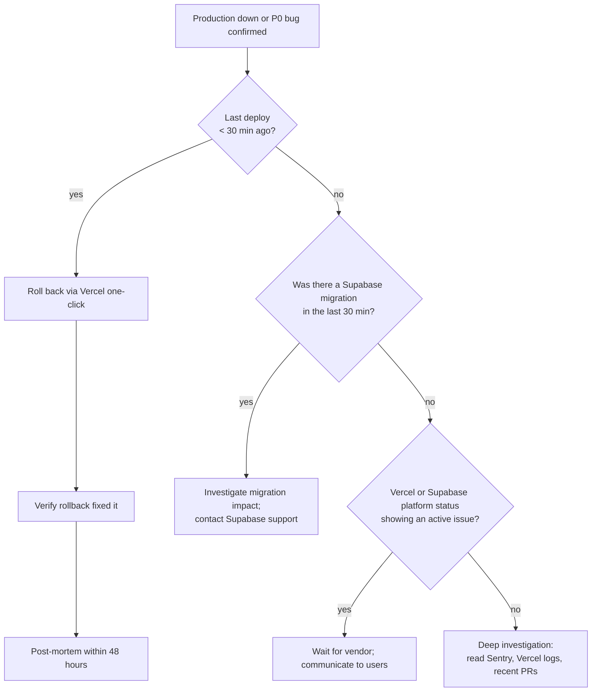

# myaircraft.us — Incident Response Runbook

**Last updated:** 2026-05-21 · **Owner:** on-call engineer · **Audience:** on-call + leadership + SOC2 auditor

> Referenced from **SOP-13 §13.6 Incident Response** and **SOP-12 §12 Owner Portal Security**. This runbook is the operational playbook for when something is on fire in production.

---

## 1. Severity classification

| Severity | Definition | First-response SLA |
|---|---|---|
| **P0 — Critical** | Production down OR confirmed security incident (data breach, account compromise affecting >1 customer, exposed secrets) | 5 minutes acknowledge · 1 hour stabilize |
| **P1 — High** | Critical feature broken for >50% of users, or financial integrity at risk (Stripe, invoice math, signature integrity) | 15 minutes acknowledge · 4 hours stabilize |
| **P2 — Medium** | Feature broken for a subset, or degraded performance, or stuck ingestion queue | 1 hour acknowledge · same-day fix |
| **P3 — Low** | Cosmetic, accessibility, or non-blocking | Next business day |

---

## 2. Detection sources

| Source | Channel | Action |
|---|---|---|
| Vercel deployment failure | Vercel email + Slack `#deploys` | On-call investigates within 5 min |
| Sentry error spike | Sentry → Slack `#errors` | Acknowledge; classify |
| Supabase service alert | Email + status page | Coordinate with Supabase support |
| User report (email / portal feedback) | `support@myaircraft.us` | Triage; assign severity |
| Synthetic monitor (planned) | Status page | Auto-acknowledge |
| Cron job failure (`heal-ingestions`, `wo-audit`, etc.) | Vercel cron error logs | On-call investigates |

---

## 3. P0 — Production-down playbook

### 3.1 First five minutes

1. **Acknowledge** in `#incidents` Slack channel — drops a known-good template:
   ```
   🚨 P0 incident detected: <one-line description>
   Detected at: <ISO timestamp>
   Suspected cause: <if any>
   On-call: <name>
   Status page update: <link>
   ```
2. **Confirm the symptom.** Hit `www.myaircraft.us/` — does it 5xx? Does the login flow work? Does `/api/health` (planned) return 200?
3. **Check Vercel status** at status.vercel.com — is it us or them?
4. **Check Supabase status** at status.supabase.com — same.

### 3.2 Rollback decision tree



### 3.3 Vercel one-click rollback

1. Open https://vercel.com/horf/myaircraft01/deployments
2. Find the previous good production deployment (state=READY, target=production)
3. Click "..." → "Promote to Production"
4. Confirm. DNS alias updates within 30 seconds.
5. Verify in browser; the previous SHA should now be serving.

### 3.4 Communicate

- Update the status page (planned at `status.myaircraft.us` — currently a Slack-only announcement)
- Email affected customers within 1 hour
- Post in `#incidents`: progress every 30 minutes until resolved

---

## 4. Security incident playbook

### 4.1 Suspected data breach

1. **Isolate.** If a specific data path is suspected (e.g., a leaky API endpoint), disable the route via Vercel deployment OR a feature flag.
2. **Snapshot evidence.** Capture:
   - Sentry stack traces
   - Vercel logs for the suspect time window
   - Supabase audit logs (`audit_event` table)
   - List of affected customer org_ids
3. **Revoke compromised credentials.** Service-role keys, OAuth tokens, Stripe secrets — rotate any that may have been exposed.
4. **Escalate to leadership** — CEO + general counsel.
5. **Customer notification** — GDPR: 72 hours from awareness. State laws vary.

### 4.2 Owner-account compromise

If an owner reports their portal account was accessed without authorization:

1. **Force-logout the user.** Supabase auth admin → invalidate refresh tokens.
2. **Reset password** — send a password-reset link to the verified email.
3. **Audit recent actions.** Pull `audit_event` rows for this user_id in the past 30 days; review approvals, payments, downloads for anything anomalous.
4. **Notify the linked shop** so they can flag any in-progress approvals.
5. If the audit shows unauthorized actions, refund/reverse and follow §4.1 escalation.

### 4.3 Suspected service-role key leak

The service-role key bypasses RLS — a leak is catastrophic.

1. **Rotate immediately** via Supabase dashboard → Settings → API → Generate new service role.
2. **Update Vercel env vars** (`SUPABASE_SERVICE_ROLE_KEY`) for production + staging.
3. **Trigger a redeploy** (`vercel --prod`) to pick up the new key.
4. Confirm old key returns 401 on a test query.
5. **Audit all data access** in the leak window — any abnormal patterns in `audit_event`, Supabase logs, or Sentry.

---

## 5. P1 — High-severity feature broken

Example: `/api/upload` is 500'ing. Owner approvals failing. AI returns "insufficient_evidence" on every query.

1. Acknowledge in `#incidents`.
2. Try to repro — reach for the affected feature and observe.
3. Check Vercel function logs for the affected route.
4. Check `rag_query_log` if AI-related — see if a specific failure pattern is recent.
5. **Hotfix or rollback** based on the same decision tree as P0.

---

## 6. P2 — Degraded performance

Example: queries slow, dashboard takes 5 seconds to load, ingestion queue backed up.

1. Acknowledge.
2. Check:
   - Supabase database CPU / connection count
   - pgvector query latency
   - Vercel function p95 latency
   - Ingestion queue depth (`documents` where `parsing_status != 'completed'` ordered by `uploaded_at` ASC)
3. If ingestion is stuck → run the `heal-ingestions` cron manually OR re-trigger via `app/api/cron/heal-ingestions`.
4. If Supabase is the bottleneck → check the query analyzer; identify the slow query; index or rewrite.

---

## 7. Contact escalation

| Role | Primary | Backup |
|---|---|---|
| On-call engineer | Andy | (TBD second engineer) |
| Engineering lead | Andy | n/a |
| CEO / GC | Andy | n/a |
| Vercel support | Pro plan support portal | n/a |
| Supabase support | Pro plan ticket | n/a |
| Stripe support | dashboard chat | radar.alerts@stripe.com |

**Note:** the platform is currently single-engineer (Andy). The backup column is honest about that. Hiring a second engineer is on the roadmap; this runbook will be updated when redundancy exists.

---

## 8. Post-mortem template

Within 48 hours of resolving any P0 or P1:

```markdown
# Post-Mortem — <title>

## Summary
- Severity: P0 / P1
- Detected at: <UTC>
- Resolved at: <UTC>
- Duration: <H:MM:SS>
- Customers impacted: <count, scope>

## Timeline
- <UTC> — first signal
- <UTC> — acknowledged
- <UTC> — root cause identified
- <UTC> — mitigation deployed
- <UTC> — fully resolved

## Root cause
<technical explanation>

## What went well
- <bullet>

## What went poorly
- <bullet>

## Action items
- [ ] <owner> — <action> — by <date>
```

Post-mortems are **blameless**. The goal is system improvement, not punishment.

---

## 9. References

- SOP-13 — Full-Stack Architecture (§13.6 Incident Response, §14 Backup & Disaster Recovery)
- SOP-12 — Owner Portal (§12 Security)
- `docs/disaster-recovery-runbook.md` — DR-specific procedures
- Vercel inspector: https://vercel.com/horf/myaircraft01
- Supabase project: https://supabase.com/dashboard/project/ygrqinxkeqvikpfmjqiz
- Sentry: TBD project URL

---

**Last reviewed:** 2026-05-21. Reviewed quarterly minimum.
