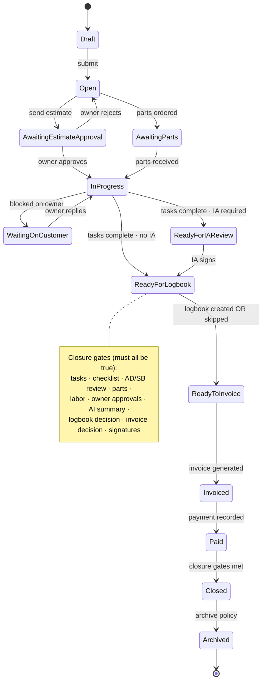

# myaircraft.us Work Order Execution System - Universal Product Specification

**Audience:** Codex / Claude Code / engineering agents / product implementation.

**Purpose:** Define the universal source-of-truth rules, UI architecture, workflow behavior, permissions, and data requirements for the myaircraft.us work-order detail page after a work order has been created.

**Do not treat this as a loose design note. Treat it as the canonical operating contract for every work-order surface: web, iPad, mobile, owner portal, print packet, invoice, and logbook generation.**

---

## 1. Core Doctrine

The created work order is the operational source of truth, but it contains three separate truth layers:

### 1.1 Checklist Source of Truth

The checklist controls the work.

Checklist source priority:

1. Shop-approved checklist template from Settings.
2. Checklist generated from uploaded PDF / Word / maintenance manual, after mechanic verification.
3. AI-generated checklist from work-order type, aircraft, squawks, AD/SB, FAA rules, and shop settings when no approved template exists.

Rules:

- If a shop-approved checklist exists, AI must not replace it.
- AI may map, suggest, structure, or add work-order-specific supplemental items.
- A mechanic, lead, or IA must verify a generated checklist before it is treated as approved.
- Failed checklist items cannot disappear. They must become a corrective action, squawk, deferred item, customer approval request, or waiver with authorized reason.

### 1.2 Actual Work Source of Truth

The estimate is the plan. The work order is reality.

Rules:

- Estimated labor and estimated parts are copied into the work order as planned line items.
- Actual timer entries, manual labor, installed parts, returned parts, added parts, and outside services update the actual line items.
- Final invoice generation uses approved actual work-order line items, not blindly copied estimate lines.
- Unused estimated parts should be removed, zeroed, or marked not used.
- Extra parts/labor outside approved thresholds require owner approval unless shop policy allows internal approval.

### 1.3 Record Source of Truth

The final logbook and compliance record must be generated from reviewed work-order facts:

- Completed checklist.
- Actual line items.
- Actual parts installed.
- AD/SB compliance decisions.
- Corrective actions.
- Labor entries.
- Mechanic notes, photos, videos, and attachments.
- IA/lead review.
- Signed logbook entry.

AI may draft logbook text, summaries, invoice explanations, and customer summaries. AI must not silently finalize, sign, or approve maintenance records.

---

## 2. Required Work Order Modes

### 2.1 Mechanic Execution Mode

Target users: mechanic, A&P, apprentice, avionics tech, parts staff.

Primary UI elements:

- My assigned task.
- My assigned checklist.
- Start / stop timer.
- Add labor.
- Add part.
- Add note.
- Add photo / video / document.
- Voice dictation.
- Internal chat.
- Complete task / handoff button.

Design requirements:

- Mobile-first.
- Large tap targets.
- Offline-tolerant drafting for notes, photos, checklist taps, timer events, and part usage.
- Minimal visible tabs on mobile.

### 2.2 Lead / IA Control Mode

Target users: lead mechanic, IA, shop owner, admin/billing.

Primary UI elements:

- Work-order operating picture.
- Task and checklist progress.
- Actual vs estimated labor.
- Actual vs estimated parts.
- Owner approvals.
- Internal chat.
- Owner chat.
- AI review console.
- Logbook entry.
- Invoice readiness.
- Close gates.

Design requirements:

- Desktop and iPad optimized.
- Clear readiness gates.
- Fast navigation to blockers.
- Strong separation of internal, owner-facing, and audit content.

---

## 3. Universal Tab Architecture

### 3.1 Desktop Tabs

Use these primary tabs:

1. Overview
2. Tasks
3. Checklist
4. Line Items
5. Activity
6. Owner View
7. AI Summary
8. Logbook
9. Invoice
10. More

Move lower-frequency items into `More`:

- Media
- AD/SB
- Tools
- Attachments
- Print history
- Audit trail

AD/SB may become a primary visible tab if the work-order type is AD/SB compliance.

### 3.2 Mobile Tabs

Use:

1. Overview
2. My Task
3. Checklist
4. Lines
5. More

Sticky bottom action bar:

- Timer
- Add Part
- Add Labor
- Photo
- Chat

Mechanics must not see eleven tabs on a phone.

---

## 4. Overview Tab Requirements

The Overview tab shows the operating picture only.

Header fields:

- Work-order number.
- Status.
- Tail number.
- Make/model.
- Location.
- Lead mechanic.
- Due date / estimated ready date.
- Owner visibility status.
- Primary state-aware action.

State-aware primary action:

- Draft: Continue Setup.
- Open: Start Work.
- In Progress: Review Progress.
- Ready for IA Review: IA Review.
- Ready to Invoice: Generate Invoice.
- Ready to Close: Close Work Order.

Overview cards:

1. Scope: complaint, included squawks, work type, summary.
2. Progress: tasks complete, checklist complete, gates remaining.
3. Labor: estimated labor, actual labor, variance.
4. Parts: estimated parts, installed parts, requested/backordered parts.
5. Owner Approval: estimate approved, change orders pending, unread owner messages.
6. Close Readiness: checklist, logbook, invoice, signature status.

---

## 5. Tasks Tab Requirements

Tasks must be assignment cards, not only a table.

Each task includes:

- Task title.
- Assigned user.
- Required role.
- Status.
- Due date.
- Attached checklist.
- Labor logged.
- Parts used.
- Blocking issue.
- Handoff button.

Task statuses:

- Not Started
- In Progress
- Blocked
- Waiting for Parts
- Waiting for Owner Approval
- Ready for Review
- Completed
- Waived

Task actions:

- Assign/reassign.
- Add checklist.
- Add part.
- Start timer.
- Add note/photo.
- Mark complete.
- Hand off to next person.

Completion rule:

- When a task is completed, log who completed it, when, and what data was attached.

---

## 6. Checklist System Requirements

### 6.1 Checklist Library in Settings

Settings must include a Checklist Library supporting:

- Annual Inspection
- 100-Hour Inspection
- Oil Change
- Squawk Repair
- Avionics
- Engine
- Propeller
- Airframe
- AD/SB Compliance
- Custom checklist

Checklist creation methods:

- Manual entry.
- Upload PDF.
- Upload Word document.
- AI generate from FAA / shop instructions.
- Duplicate existing template.
- Import from aircraft or prior work order.

After PDF/Word upload, parse into structured rows:

- Section.
- Item.
- Reference.
- Required/optional.
- Default assignee role.
- Result type.
- Requires note?
- Requires photo?
- Requires signature?
- Can create squawk?
- Can create line item?

The mechanic/lead/IA must verify parsed checklists before publishing.

### 6.2 Checklist Execution

Checklist rows support:

- Pass.
- Fail.
- N/A.
- Deferred.
- Needs Review.
- Add note.
- Add photo.
- Add labor.
- Add part.
- Create squawk.
- Request owner approval.
- Require IA signoff.

Desktop/iPad grouping:

- Airframe.
- Engine.
- Propeller.
- Avionics.
- Interior.
- Exterior.
- AD/SB.
- Final inspection.
- Logbook / return to service.

Mobile presentation:

- One checklist item per card.
- Large result buttons.
- Photo/note/part/labor actions on each card.

Failure rule:

- A failed checklist item must become a corrective action task, squawk, deferred item, customer approval request, or waiver with reason.

---

## 7. Line Item Requirements

The Line Items tab reconciles estimate vs actual.

Each line item includes:

- Source: Estimate, Manual, Timer, Part Installed, Checklist Fail, Owner Approved Change, Outside Service.
- Type: Labor, Part, Shop Supply, Outside Service, Discount, Deposit Credit, Tax.
- Description.
- Estimated quantity.
- Actual quantity.
- Unit rate.
- Billable flag.
- Owner approval status.
- Invoice status.
- Linked task.
- Linked mechanic.

Actual-vs-estimate behavior:

- Show estimate quantity, actual quantity, variance, approval status.
- Timer/manual labor updates actual labor lines.
- Installed parts update actual part lines.
- Unused estimated parts are reduced/removed/not-used.
- New additional lines outside policy require owner approval.

Invoice generation rule:

- Invoice uses approved actual labor, installed parts, approved outside services, deposits, taxes/fees, and approved change orders.
- Do not invoice unused estimated items unless intentionally marked billable by authorized user.

---

## 8. Activity, Internal Chat, Owner Chat

### 8.1 Activity Timeline

Activity is immutable system history.

Examples:

- Work order created.
- Task assigned.
- Checklist item failed.
- Timer started/stopped.
- Part installed.
- Owner approved change order.
- Logbook entry generated.
- Invoice sent.
- Payment received.
- Work order closed.

Corrections create new entries; activity entries are not silently edited.

### 8.2 Internal Chat

Internal chat is for mechanics, lead, IA, and shop team.

Supports:

- Text.
- Photos.
- Video.
- Voice dictation.
- File attachments.
- Mentions.
- Task links.
- Checklist item links.
- Part links.
- Convert message to note.
- Convert message to owner update.
- Convert message to task.

Internal chat is never owner-visible unless explicitly shared.

### 8.3 Owner Chat

Owner chat is lead-to-owner by default.

Supports:

- Owner questions.
- Lead responses.
- Estimate approval.
- Change-order approval.
- Additional labor approval.
- Additional parts approval.
- ETA updates.
- Owner-visible photos.
- Invoice/payment link.

Owner chat notifies lead/admin, not every mechanic.

Approval audit capture:

- Owner user ID or guest identity.
- Timestamp.
- IP address.
- Browser/device metadata.
- Approved amount.
- Approved scope.
- Terms accepted.
- Signature/typed name if required.
- Related estimate/change-order ID.

Do not promise MAC address capture from browser clients.

---

## 9. Owner View Requirements

Owner View is a permission-controlled portal preview, not a mirror of the mechanic work order.

Lead controls visibility for:

- Aircraft info.
- Work-order description.
- Status.
- Estimated completion date.
- Approved estimate.
- Current invoice total.
- Line item summary.
- Photos.
- Customer-facing notes.
- Checklist progress summary.
- Logbook entry after completion.
- Invoice/payment link.

Owner must not see by default:

- Internal notes.
- Internal mechanic chat.
- Internal labor disputes.
- Diagnostic uncertainty unless shared.
- Vendor cost if hidden by shop policy.
- Technician-only comments.
- Draft AI summaries.

Owner actions:

- View permitted status.
- Message lead.
- Approve estimate.
- Approve change order.
- Approve additional labor.
- Approve additional parts.
- Pay invoice.
- Download final invoice/logbook if enabled.

Owner-facing statuses:

- Received.
- Inspection in Progress.
- Waiting for Approval.
- Parts Ordered.
- Work in Progress.
- Final Review.
- Ready for Pickup.
- Invoice Ready.
- Closed.

---

## 10. AI Summary Requirements

AI Summary is a review console, not a magic finalization button.

AI outputs:

1. Internal work summary.
2. Customer summary.
3. Compliance summary.
4. Invoice explanation.
5. Logbook draft.

AI must flag:

- Missing tach/Hobbs/total time.
- Checklist incomplete.
- Failed item unresolved.
- AD/SB applicability uncertain.
- Parts installed but not tied to line item.
- Labor logged but not reviewed.
- Owner approval missing.
- Logbook missing certificate info.
- Invoice mismatch.

Human approval requirements:

- Lead/IA must review and approve before close.
- AI cannot sign logbook entries.
- AI cannot approve return to service.

---

## 11. Logbook Requirements

Logbook generation pulls from:

- Work-order type.
- Actual completed tasks.
- Completed checklist.
- Corrective actions.
- AD/SB compliance.
- Parts installed.
- Tach/Hobbs/total time.
- Mechanic/IA profile.
- Certificate number.
- Inspection result.
- Return-to-service decision.

Required UI fields:

- Entry type: Maintenance, Inspection, AD/SB Compliance, Repair, Alteration.
- Aircraft.
- Date completed.
- Tach/Hobbs/total time.
- Description of work.
- References.
- Parts installed if relevant.
- Person approving return to service.
- Certificate number.
- Certificate type.
- IA status/number if applicable.
- Signature.
- Signature certificate/audit trail.

Signature certificate fields:

- Signer name.
- User ID.
- Certificate number.
- Certificate type.
- IA status.
- Organization.
- Timestamp.
- IP address.
- Device/browser metadata.
- MFA/identity confirmation.
- Work-order ID.
- Logbook entry ID.
- Record hash.
- Previous record hash.
- Final rendered PDF hash.
- Revision number.

Signed records are immutable. Revisions preserve old version, new reason, and hash chain.

---

## 12. Invoice Requirements

Invoice readiness panel shows:

- Labor reviewed.
- Parts reviewed.
- Owner approvals complete.
- Deposit applied.
- Taxes/fees calculated.
- Logbook generated or skipped with reason.
- Payment status.

Invoice actions:

- Generate invoice.
- Preview invoice.
- Send to owner.
- Record payment.
- Mark paid.
- Refund deposit.
- Export PDF.
- Sync to accounting if implemented.

Payment record fields:

- Method.
- Amount.
- Date.
- Reference number.
- Receipt.
- User who recorded payment.
- Owner-facing receipt.

---

## 13. Print / Manual Workflow

Print options:

1. Work-order summary.
2. Mechanic task sheet.
3. Checklist packet.
4. Parts list.
5. Customer estimate.
6. Final invoice.
7. Logbook draft.
8. Full audit package.

Paper return workflow:

1. Print work order/checklist.
2. Mechanic completes paper checklist.
3. Mechanic/lead uploads scan/photo.
4. System OCR extracts checklist items, notes, labor, parts, signatures/initials, dates.
5. User reviews extracted data.
6. User confirms import.
7. System creates activity entries and updates checklist/line items.

OCR import must never silently update final records. It must be review-confirmed.

---

## 14. Attachments and Media

Attachment types:

- Inspection photo.
- Damage photo.
- Part tag.
- 8130 / certificate.
- Manual excerpt.
- Customer approval.
- Paper checklist scan.
- Vendor invoice.
- Logbook supporting document.
- General attachment.

Every attachment supports:

- Internal only.
- Owner visible.
- Linked task.
- Linked checklist item.
- Linked line item.
- Linked logbook entry.
- Linked invoice.

---

## 15. Status and Gate Model

Work-order statuses:

- Draft.
- Open.
- Awaiting Estimate Approval.
- Awaiting Parts.
- In Progress.
- Waiting on Customer.
- Ready for IA Review.
- Ready for Logbook.
- Ready to Invoice.
- Closed.
- Invoiced.
- Paid.
- Archived.

Closure gates:

- Required tasks complete.
- Required checklist complete.
- Failed checklist items resolved.
- AD/SB reviewed or marked not applicable.
- Parts reconciled.
- Labor reconciled.
- Owner approvals complete.
- AI summary reviewed.
- Logbook created or skipped with reason.
- Invoice generated or skipped with reason.
- Required signatures complete.

Close button must remain disabled until required gates are satisfied or waived by authorized user.

---

## 16. Roles and Permissions

Roles:

- Apprentice / trainee.
- Mechanic.
- A&P.
- IA.
- Lead mechanic.
- Parts manager.
- Admin / billing.
- Owner/customer.
- Shop owner/platform admin.

Permission examples:

- Apprentice: add photos/notes; complete assigned checklist if allowed; cannot sign logbook.
- Mechanic/A&P: add labor/parts, complete tasks, add corrective action, approve return to service only if permitted.
- IA: review annual/inspection, sign IA-required entries, approve AD/SB compliance.
- Lead: assign/reassign, approve line items, manage Owner View, close work order.
- Admin/billing: generate/send invoice, record payment; cannot sign maintenance records unless certified.
- Owner: view permitted content, message lead, approve estimate/change order, pay invoice.

---

## 17. Regulatory References for Implementation

Build compliance-supporting features around these references:

- 14 CFR 43.9: maintenance record entries for maintenance, preventive maintenance, rebuilding, and alteration.
- 14 CFR 43.11: inspection record entries.
- FAA AC 120-78B: electronic signatures, electronic recordkeeping, and electronic manual systems.
- FAA AC 43-9D: maintenance records and FAA Form 8130-3 return to service guidance.

Implementation must avoid legal overclaiming. The product should support compliant recordkeeping workflows, but final responsibility remains with authorized humans.

---

## 18. Engineering Acceptance Criteria

A correct implementation must satisfy all of the following:

- Desktop, iPad, and mobile layouts are supported.
- Mobile mechanic view shows large action buttons and minimal tabs.
- Checklist source hierarchy is implemented.
- Uploaded PDF/Word checklists are parsed, then user-verified before use.
- Actual labor and parts update actual line items.
- Invoice generation uses approved actuals.
- Internal chat and owner chat are separate.
- Owner View uses explicit visibility controls.
- Owner approvals capture audit metadata.
- Activity timeline is immutable.
- AI outputs are review-only drafts.
- Logbook signature includes certificate/audit metadata.
- Signed records are revision-controlled and hash chained.
- Print/manual/OCR workflow requires review before data import.
- Closure gates prevent incomplete or inconsistent closure.
