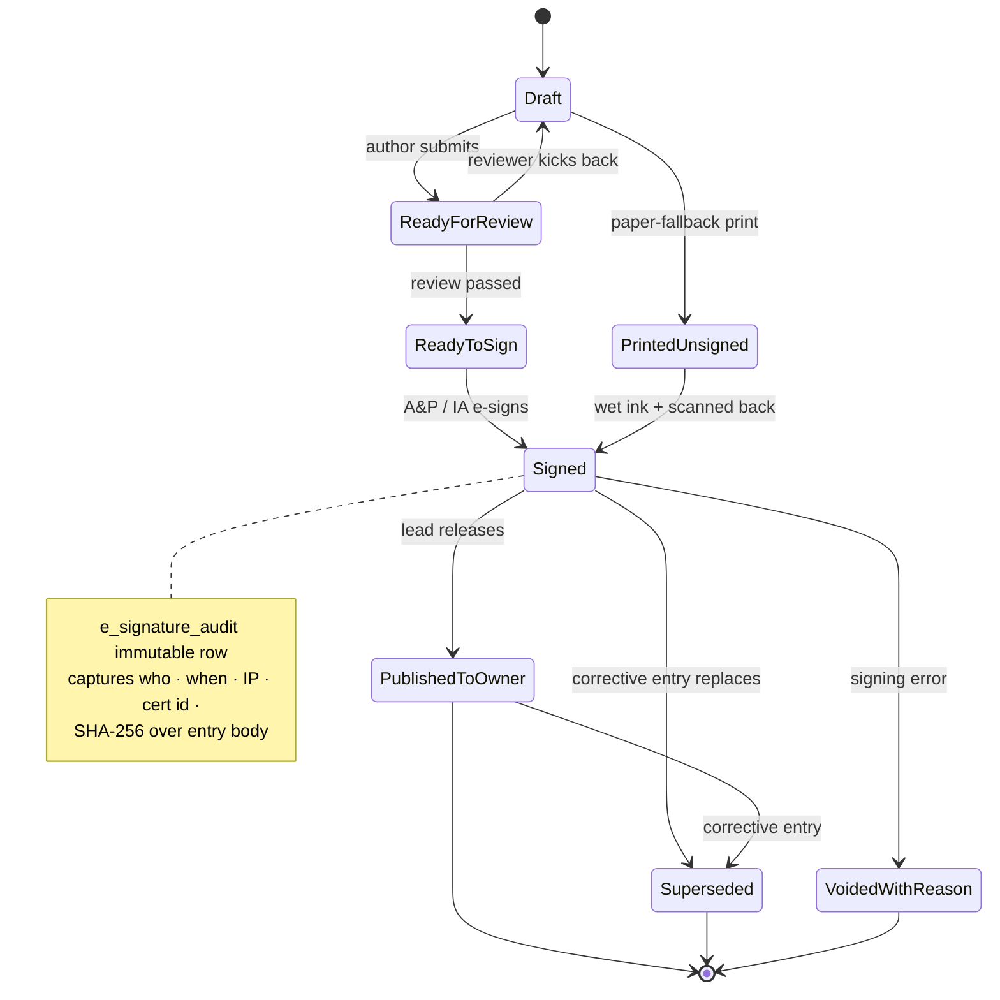

# myaircraft.us - Logbook Entries SOP and Codex Implementation Specification

## 1. Purpose

The Logbook Entries module creates component-specific maintenance and inspection record entries for aircraft, airframe, engine, propeller, avionics, appliances, and components. The module must support work-order-generated entries, aircraft-generated entries, global/manual entries, shop templates, AI-assisted drafting, human review, digital signing, unsigned print output for wet signature, signed PDF/link delivery, owner publication, revision control, and audit traceability.

## 2. Non-Negotiable Source-of-Truth Rule

**Logbook entry is the human-signed maintenance record. AI drafts; the certificated human signs and owns the final wording.**

Work orders provide the facts. Templates provide standard language. AI may synthesize and highlight missing information. The final signed record is owned by the authorized signer.

## 3. FAA-Aligned Recordkeeping Anchors

This specification is designed to support FAA-style recordkeeping workflows. Product implementation must not represent itself as legal advice or FAA certification. The UI must help the shop capture the fields required by applicable regulations and preserve audit/revision history.

- 14 CFR 43.9: maintenance record entries should support description/reference to acceptable data, completion date, performer if different, and signature/certificate/kind of certificate for the person approving satisfactory work.
- 14 CFR 43.11: inspection records should support inspection type/extent, inspection date, aircraft total time, signature/certificate/kind of certificate, and the appropriate airworthy or discrepancy statement.
- 14 CFR 91.417: owner/operator recordkeeping should support maintenance/inspection records, total time, life-limited status, overhaul status, inspection status, AD status, and required retention/transfer behavior.
- FAA AC 43-9D: maintenance records may be kept in formats that provide continuity, required contents, addition of new entries, signature entry, and intelligibility; AC 43-9D is guidance and not independently binding law.
- AC 120-78 is referenced by FAA guidance for electronic signatures, electronic recordkeeping, and electronic manuals. The product should use identity verification, signature audit certificate, hashes, and revision history.

## 4. Approved UI Architecture

### 4.1 Logbook Dashboard

The dashboard shows all logbook entries across the shop. It supports filters for draft, ready, signed, needs review, source, component logbook, signer, aircraft, AD/SB, and work order.

Primary dashboard elements:

- Search by aircraft, signer, source, AD/SB, logbook type, work order, and entry ID.
- Status cards: Draft, Signed, From Work Order, Needs Review.
- Entry table: Entry ID, aircraft, target logbook, source, status.
- Actions: + Entry, Templates, Export, Certificate Log.

### 4.2 Create Entry - Choose Source

Creation must be context-aware.

| Source | Required behavior |
|---|---|
| From Work Order | Preferred path. Auto-pull aircraft, times, tasks, checklist, parts, AD/SB, AI summary, attachments, and source references. |
| From Aircraft | Aircraft locked. User selects related work order, template, or manual entry. |
| From Logbook Module | User must select aircraft first, then optionally select work order/template/manual path. |
| Manual Entry | Requires aircraft, target logbook, entry type, date, time data, text, signer, and certificate details. |

### 4.3 Auto-Mapped Work Order Draft

When generated from a work order, the system pulls:

- Aircraft, owner, make/model, serial, tail number.
- Work order ID and status.
- Tach, Hobbs, total time.
- Tasks completed.
- Checklist completion and failed/deferred items.
- Parts installed and removed.
- AD/SB review, compliance, and applicability decisions.
- AI Summary and internal findings.
- Attachments, photos, paper checklist scans, and supporting files.

### 4.4 Component Logbook Target

A single work order may create multiple logbook entries. Each entry must target the correct record set.

Supported targets:

- Airframe
- Engine
- Propeller
- Avionics
- Appliance/component

The UI must allow multiple generated entries from one source work order.

### 4.5 Template + AI Draft

Drafting priority:

1. Shop-approved template.
2. Work-order facts.
3. AD/SB decisions.
4. Checklist and task results.
5. Parts and corrective actions.
6. AI-synthesized wording and warnings.

The AI must never sign, approve, or finalize an entry.

### 4.6 Digital Signature + Certificate

Signer profile auto-fills:

- Signer name.
- Certificate number.
- Certificate type.
- IA flag if applicable.
- Organization.

Signature certificate captures:

- User ID.
- Full name.
- Certificate number and type.
- IA flag.
- Timestamp and timezone.
- IP address.
- Device/browser metadata.
- MFA or reauthentication event.
- Signature reason.
- Source references.
- Entry hash.
- Rendered PDF hash.
- Previous revision hash.

Do not promise MAC address capture in a browser app. Use IP, device/browser metadata, MFA, and hashes instead.

### 4.7 Output Rules

| Output | Behavior |
|---|---|
| Print | Print unsigned entry for wet signature. Do not include digital signature image or digital certificate unless explicitly configured. |
| Email signed PDF | Include final signed entry and signature certificate/audit page. |
| Share link | Secure signed entry link with access logging. |
| Owner portal | Final signed entries only. Hide drafts, internal notes, and internal chat. |
| Revision | Any change after signature creates a new revision and preserves the prior version/hash. |

## 5. Status Model



- Draft
- Ready for Review
- Ready to Sign
- Signed
- Published to Owner
- Printed Unsigned
- Superseded
- Voided with Reason

## 6. Permissions

| Role | Create Draft | Edit Draft | Generate AI | Sign | Publish Owner | Void/Supersede | View Certificate |
|---|---:|---:|---:|---:|---:|---:|---:|
| Apprentice | Limited | Own drafts only | Yes | No | No | No | No |
| Mechanic/A&P | Yes | Yes | Yes | If authorized | Limited | No | Own |
| IA | Yes | Yes | Yes | Yes | Yes | Yes | Yes |
| Lead Mechanic | Yes | Yes | Yes | If certified | Yes | Yes | Yes |
| Admin/Billing | Draft only | Nontechnical fields | No | No unless certified | Yes | No | Limited |
| Owner | No | No | No | No | View final only | No | Owner-facing cert only |

## 7. Data Model Requirements

### logbook_entry

- id
- aircraft_id
- target_logbook
- entry_type
- source_type
- source_id
- work_order_id
- date
- tach
- hobbs
- total_time
- text
- references
- signer_id
- certificate_number
- certificate_type
- ia_flag
- status
- revision_number
- supersedes_entry_id

### signature_certificate

- id
- logbook_entry_id
- signer_user_id
- signer_name
- certificate_number
- certificate_type
- ia_flag
- timestamp
- timezone
- ip_address
- device_metadata
- session_id
- mfa_event_id
- signature_reason
- entry_hash
- pdf_hash
- previous_revision_hash
- source_references

### logbook_source_bundle

- logbook_entry_id
- aircraft_id
- work_order_id
- task_ids
- checklist_item_ids
- part_ids
- ad_sb_ids
- attachment_ids
- ai_summary_id

### audit_event

- id
- actor_id
- target_type
- target_id
- action
- timestamp
- aircraft_id
- source_context
- immutable_payload

## 8. Acceptance Criteria

- Creating from work order auto-maps aircraft, times, WO facts, AD/SB, tasks, checklist, parts, AI summary, attachments, and source refs.
- Creating globally requires aircraft before official save.
- Entries can be generated separately for airframe, engine, propeller, avionics, and appliance/component.
- Shop template is preferred and AI supplements missing WO/compliance detail.
- Human review is required before signing.
- Signer data is pulled from profile and cannot be silently edited during signature.
- Digital certificate includes identity, certificate, timestamp, IP, device metadata, MFA, hashes, and source references.
- Printed unsigned output is supported for wet signature.
- Email/link output includes signed PDF and certificate.
- Signed records are immutable; edits create revisions.
- Aircraft timeline updates for draft, generated, reviewed, signed, printed, emailed, shared, published, voided, and superseded events.

## 9. QA Scenarios

1. Generate airframe, engine, and propeller entries from WO-0512.
2. Create manual avionics entry without work order.
3. Generate from aircraft with no active work order and use shop template.
4. Missing tach/total time should warn before signing.
5. Missing certificate profile should block signature.
6. Print unsigned and verify no digital signature certificate appears.
7. Email signed PDF and verify certificate is included.
8. Revise signed entry and verify old entry/hash is preserved.
9. Owner portal should show final signed entry only.
10. AI draft with uncertain AD/SB must mark Needs IA Review.

## 10. Baseline Uploaded Specification

The following uploaded baseline remains incorporated:

```markdown
# Logbook Entries - Codex Implementation Specification

## Purpose
Logbook entries generate component-specific maintenance records from work order facts, aircraft data, templates, or manual input, then require human signature.

## Source-of-Truth Rule
Logbook entry is a human-signed maintenance record. AI drafts; certificated human signs and owns the final wording.

## Core Principles

- From work order is preferred: pull aircraft, tach/Hobbs/total time, tasks, checklist results, parts, AD/SB decisions, AI summary, attachments, and source references.
- If created globally, select aircraft first, then work order/template/manual path.
- Entries must target correct logbook: Airframe, Engine, Propeller, Avionics, Appliance/component.
- Shop templates are used first; AI supplements missing detail from WO and compliance data; signer owns final text.
- Print output can be unsigned for physical signature; email/link/PDF can include digital signature certificate.

## User Workflow

1. Open logbook dashboard
2. Click + Entry
3. Choose source: work order/aircraft/template/manual
4. Select aircraft if global
5. Select target logbook/component
6. Select template or AI-generate
7. AI drafts comprehensive entry using WO summary/AD-SB/checklists/parts
8. Human edits/reviews
9. Signer profile auto-fills name/cert/IA
10. Sign with certificate/audit trail
11. Print unsigned or send signed PDF/link
12. Notify and update aircraft timeline

## UI Requirements

### Logbook Dashboard
- Draft, ready, signed, review
- Search by aircraft, signer, source, AD/SB, logbook type
- Global list and aircraft tab

### Source Selection
- From work order
- From aircraft
- From module
- Manual entry
- Template entry

### Component Target
- Airframe
- Engine
- Propeller
- Avionics
- Appliance/component
- Multiple entries from one WO

### AI + Template Draft
- Template first
- AI adds AD/SB, parts, checklist, compliance details
- Warnings for missing times/cert authority

### Signature
- Name, certificate, certificate type, IA flag from profile
- IP, device/browser metadata, MFA, hashes, source refs
- No browser MAC address promise

### Output
- Print unsigned for wet signature
- Email/link with signed certificate
- Owner portal final signed entry
- Revisions preserve old version/hash

## Data Model Requirements

- logbook_entry: aircraft_id, target_logbook, entry_type, source_type, source_id, date, tach, hobbs, total_time, text, references, signer_id, certificate_number, certificate_type, ia_flag, status
- signature_certificate: timestamp, IP, device_metadata, MFA, hashes, source refs

## Permissions

- A&P/IA signs if authorized; Admin cannot sign unless certified; Owner only receives published entries; AI cannot sign.

## Acceptance Criteria

- Separate component logbooks
- WO mapping creates stronger draft
- Human review/sign required
- Signed records immutable
- Print unsigned/email signed behavior implemented

## Audit Requirements
- Every important create, edit, route, approval, signature, payment, export, and share action MUST create an immutable audit event.
- Audit events MUST include actor, target, action, timestamp, source context, and linked aircraft where applicable.
- Signed and exported records MUST use revision/version records rather than silent overwrite.

## Mobile/iPad Requirements
- Mobile must prioritize one-hand capture and hide dense tables behind review screens.
- iPad must support split-pane review where useful.
- Offline-tolerant drafting should be used for mechanic-facing capture: notes, photos, checklist taps, timers, and drafts.

```
