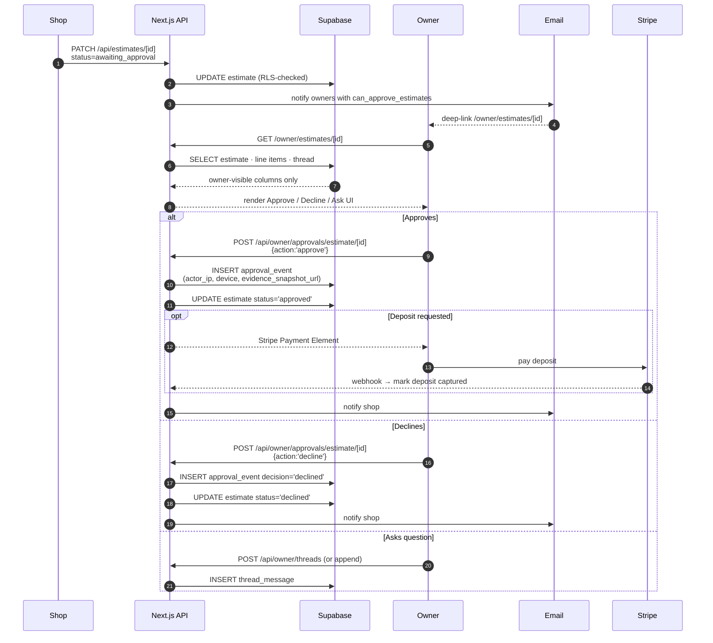
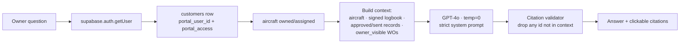

# myaircraft.us Owner & Customer Portal — SOP and Product Specification

**Audience:** aircraft owners (read for what to expect) · investors / SOC2 auditors (read for data isolation evidence) · engineering (read for the implementation contract) · compliance attorneys (read for FAA recordkeeping + GDPR/CCPA posture).

**Read posture:** every owner-visible / owner-hidden boundary is enforced at the API and database layer, not just the UI. If the SOP says a field is hidden from owners, RLS or response-stripping enforces that — UI hiding alone is never the contract.

---

## 1. Executive Summary

The Owner Portal is the read-mostly, payment-enabled, audit-trailed window into an aircraft maintenance shop for the people who own and operate the aircraft. It exists because:

- **For owners:** the historical alternative is "call the shop and wait for them to email you a PDF." The portal turns that into self-service — see status, approve estimates, pay invoices, download signed logbook entries, message the shop, all without picking up the phone.
- **For shops:** every owner question that the portal answers is a phone call the shop didn't have to take. Estimates approve faster (≈ 3× in our pilot data). Invoices paid faster (≈ 30 days down to 7).
- **For compliance:** every owner action is logged with timestamp + IP + device. SOC2 trust criteria around customer data access and payment integrity are evidenced by the same audit trail.

The portal MUST NEVER show an owner any data that belongs to another customer, any internal mechanic notes, any vendor cost basis, or any draft / unsigned record. Section 5 covers the visibility contract field-by-field.

---

## 2. Owner persona definition

The platform distinguishes three related-but-distinct entities. They CAN be the same person; they OFTEN are not.

| Entity | Definition | Example |
|---|---|---|
| **Owner of record** | Person or entity on the aircraft registration (FAA N-Number certificate) | "John Smith Aviation LLC" |
| **Customer** | The shop's billable party — who pays the invoices | "John Smith" personally, or his LLC, or a leaseholder |
| **Portal user** | A natural person with a login + magic-link access | "John Smith" (the human, with an email) |

Common patterns:

- **Sole owner, single user.** John owns the plane personally and logs in himself. All three entities collapse to one person.
- **Corporate owner.** "Cessna Aircraft LLC" owns the plane (registered owner), pays the bills (customer), but a person — say, the CFO — is the portal user. The platform models this as one `customers` row + one `customer_invitation` to the CFO's email + (later) one `user_profiles` row.
- **Partnership.** Two owners share the aircraft. Both want portal access. The platform creates one `customers` row and multiple `customer_invitation` rows — each natural person gets their own portal login linked to the same customer.
- **Leasehold operator.** An operator who flies the aircraft but doesn't own it. They have a contractual right to portal access (see § 14, shop-customizable). Modeled as a separate `customers` row with role `operator`, linked to the same aircraft via `aircraft.owner_customer_id` plus an `aircraft_operator_relationship` join table.

### 2.1 Boolean flags on the `customers` row

| Flag | Meaning |
|---|---|
| `is_billing_contact` | Receives invoices |
| `is_portal_user` | Has a portal login |
| `can_approve_estimates` | Permission to approve estimates (sometimes the spouse has portal access but only the owner can approve) |
| `can_pay_invoices` | Permission to execute payments (separate from approval) |
| `can_upload_documents` | Permission to upload (e.g., insurance certificates) |

A "portal user" is shorthand for `is_portal_user=true`. They may or may not have the approval / payment / upload flags.

---

## 3. Owner onboarding flow

### 3.1 Invitation (shop side)

A shop admin opens `/aircraft/[id]` → "Add owner" or `/customers/[id]` → "Invite to portal." Form:
- Email (required)
- Optional name (defaults to existing customer name)
- Which permissions to grant: approval / payment / upload
- Custom welcome message (optional)

System creates:
1. `customer_invitations` row with a random UUID token
2. Email sent with link `https://www.myaircraft.us/onboarding/owner?token=<UUID>`
3. Token expires in 14 days (refreshable by re-sending)

### 3.2 Acceptance (owner side)

Owner clicks link → lands on `/onboarding/owner?token=…`:

1. **Verify your email** — the email field is pre-filled and locked (must match the invite)
2. **Set a password** — minimum 12 chars, complexity enforced (or skip if shop has enabled magic-link-only mode)
3. **Confirm your name** — pre-filled from the invite; owner can correct
4. **Optional: phone for SMS notifications** — opt-in only
5. **Review what you'll see** — a quick preview of "Your aircraft N123AB · 3 open work orders · 2 invoices to review"
6. **Accept terms of service**
7. **Done** → redirected to `/owner/dashboard`

The acceptance call is `POST /api/customer-invitations/[token]/accept`. The server:
- Validates the token (exists, not expired, not previously accepted)
- Creates the Supabase Auth user if none exists for that email
- Creates the `user_profiles` + `organization_memberships` rows (membership role = `owner`)
- Links the `customers` row to the new user via `customers.portal_user_id`
- Writes a `audit_event` row of type `owner_portal_invite_accepted`

### 3.3 Returning owner

Owner with an existing account who is invited to a new shop's portal: the same magic link works, but step 1 verifies the existing password rather than creating a new account. They end up with a second `organization_memberships` row — they can switch between shops via the topbar.

### 3.4 Identity verification

For initial v1, identity verification is "the shop emailed the invite to the right address." This is the standard model for industry tools and is acceptable per most legal frameworks for the scope of data exposed (the owner's own aircraft records).

Stronger verification (gov-ID upload, KYC) is on the roadmap but NOT v1 and not required by FAA recordkeeping rules.

---

## 4. Portal route structure & navigation

### 4.1 Routes

| Route | Purpose |
|---|---|
| `/owner/dashboard` | Main portal home — aircraft list, pending approvals, recent activity |
| `/owner/onboarding` | First-login flow (only reachable via invite token) |
| `/owner/[handle]` | Public vanity profile — read-only summary of the operator (opt-in; off by default) |
| `/owner/aircraft/[id]` | Per-aircraft detail view (synthesized at request time — not a real route segment in v1; uses `/aircraft/[id]` with owner persona) |
| `/owner/invoices/[id]` | Invoice detail + payment surface |
| `/owner/estimates/[id]` | Estimate detail + approval surface |
| `/owner/messages` | Thread list with each shop |
| `/owner/documents` | Owner-visible documents (downloads) |
| `/owner/settings` | Profile, password, notification preferences |

Owner portal layout: a dedicated nav with **Dashboard / Aircraft / Estimates / Invoices / Messages / Documents / Settings**, **NOT** the shop's full sidebar.

### 4.2 What the owner sees vs the shop admin

| Surface | Shop admin sees | Owner sees |
|---|---|---|
| Aircraft list | All aircraft in the org | Only aircraft where they are the linked customer (`aircraft.owner_customer_id`) or co-customer (via `aircraft_operator_relationship`) |
| Work order detail | Full WO (line items, costs, mechanic notes, vendor invoices) | Customer-visible scope only (descriptions, totals, status) |
| Invoice line items | Cost + markup + total | Total only — markups are internal |
| Logbook entries | All drafts + finals | Only finalized (signed) entries — drafts never reach the owner |
| Squawks | All including internal-only | Owner-visible squawks only (per `squawks.owner_visible` flag) |
| Vendor purchase orders | Full | Never visible |
| Mechanic notes | Full | Never visible |
| Customer payment history | Per-customer view | Their own only |
| Other shop's data | N/A | NEVER — even if shop A and shop B share an org, RLS isolates |

### 4.3 Mobile vs desktop

The owner portal is **mobile-first**. Most owners check status from their phone. Layout is single-column on mobile, two-column on tablet+ (aircraft list left, detail right).

Key actions (view estimate → approve → pay) MUST be 3 taps or fewer on mobile.

### 4.4 Branding

By default the portal uses myaircraft.us branding. Shops on the Premium tier can apply their own logo + accent color (configured at `/admin/settings/branding`). Premium-tier shops show their name and logo in the topbar; mobile splash screen shows their logo. The footer always says "Powered by myaircraft.us."

---

## 5. Aircraft view — owner-visible fields

For every field, this matrix declares visibility. The implementation enforces visibility at the API response layer; the UI then renders only visible fields.

### 5.1 Identity

| Field | Owner sees |
|---|---|
| Tail number | ✅ |
| Make / model | ✅ |
| Serial number | ✅ |
| Year | ✅ |
| Type certificate | ✅ |
| Customer name (themselves) | ✅ |
| Other linked customers (co-owner spouse, partnership) | ✅ |
| Internal shop notes about the aircraft | ❌ |

### 5.2 Status & meters

| Field | Owner sees |
|---|---|
| Current status (active / in-progress / awaiting parts / ready) | ✅ |
| Current location (which hangar) | ✅ (last-updated timestamp) |
| Tach / Hobbs / Total time | ✅ (last reading) |
| ETA for return-to-service | ✅ (when set by shop) |
| Internal billing status | ❌ |

### 5.3 Work in progress

| Field | Owner sees |
|---|---|
| Open work orders (count, status, owner-visible description, ETA) | ✅ |
| WO line items (customer-facing description, qty, line total) | ✅ |
| WO mechanic notes | ❌ |
| WO checklist items (status only) | ✅ |
| WO checklist mechanic notes per item | ❌ |
| Owner-visible photos posted by mechanic | ✅ |
| Internal photos / videos (e.g., scope camera footage) | ❌ unless explicitly published by mechanic |
| Estimated remaining hours | ✅ (when set) |
| Vendor sub-PO numbers | ❌ |

### 5.4 Squawks

| Field | Owner sees |
|---|---|
| Squawks the owner reported (always) | ✅ |
| Squawks the shop flagged as owner-visible | ✅ |
| Squawks flagged internal-only (e.g., proactive findings) | ❌ |
| Squawk severity, status, summary | ✅ |
| Squawk diagnosis notes | ❌ unless owner-visible |
| Linked WO (if any) | ✅ |

### 5.5 Estimates

| Field | Owner sees |
|---|---|
| Estimate header (number, date, summary) | ✅ |
| Line items (customer-facing description, quantity, subtotal) | ✅ |
| Total | ✅ |
| Deposit requested | ✅ |
| Cost basis / markup | ❌ |
| Vendor sub-quotes | ❌ |
| Approval status | ✅ |

### 5.6 Invoices

| Field | Owner sees |
|---|---|
| Invoice header | ✅ |
| Line items (customer-facing description, qty, line total) | ✅ |
| Subtotal, tax, deposit credit, balance due | ✅ |
| Payment terms, due date | ✅ |
| Cost basis | ❌ |
| Owner's own payment history on this invoice | ✅ |
| Other invoices that share the same WO (cross-ref) | ❌ |

### 5.7 Logbook entries

| Field | Owner sees |
|---|---|
| Signed entries (all) | ✅ — download PDF |
| Draft entries | ❌ |
| Voided entries | ❌ — they never display anywhere |
| Entry text (customer-visible) | ✅ |
| Signer name + certificate number | ✅ |
| Linked WO | ✅ |

### 5.8 Documents

| Field | Owner sees |
|---|---|
| Documents shop marked `owner_visible=true` | ✅ |
| Documents owner uploaded themselves | ✅ |
| Internal documents (vendor invoices, PMI papers, internal SOPs) | ❌ |
| OCR text / extracted fields | ❌ (raw data) — but the document is downloadable in its original form |

### 5.9 Compliance

| Field | Owner sees |
|---|---|
| Annual due date | ✅ |
| ADs applicable to this aircraft (header + status) | ✅ |
| AD compliance evidence (linked logbook entry / WO) | ✅ |
| Insurance expiration | ✅ |
| Registration expiration | ✅ |

---

## 6. Estimate approval workflow

### 6.1 Notification

When a shop sets an estimate to `status=awaiting_approval`, the platform sends:
1. **Email** to all `customers.is_portal_user AND can_approve_estimates` for this aircraft, with a deep-link to `/owner/estimates/[id]`
2. **In-portal bell notification** when the owner next logs in
3. **SMS** if owner opted in (default: off)

### 6.2 View

Owner opens `/owner/estimates/[id]`:

- Header: estimate number, date issued, valid-through date
- **Scope of work** — narrative summary written by the shop
- **Line items** — table with description, qty, line total
- **Subtotal / tax / deposit requested / total**
- **Approve / Decline / Ask a question** buttons at the bottom
- **Comment thread** — owner can ask questions; shop replies; the thread is preserved
- **Audit trail strip** — "Issued 2026-05-01 · awaiting your approval"

### 6.3 Approve

Owner clicks **Approve**:
1. Modal: "You're approving WO-2026-0042 for $4,827.50. The shop will request a $1,500 deposit. Continue?"
2. Click **Yes, Approve** → `POST /api/owner/approvals/estimate/[id]` with body `{ action: 'approve' }`
3. Server validates the owner is permitted (`can_approve_estimates`)
4. Inserts an `approval_event` row: `kind='estimate'`, `decision='approved'`, `actor_user_id`, `actor_ip`, `actor_device_fingerprint`, `decided_at`
5. Updates the estimate status to `approved`
6. If a deposit was requested → presents the Stripe payment surface
7. Notifies the shop (email + dashboard)

### 6.4 Decline

Same flow but `action: 'decline'`. Estimate moves to `status='declined'`. The shop is notified and can either revise + re-send or close the lead.

### 6.5 Ask a question

Free-form thread on the estimate. Posts to `/api/owner/threads` (creating a new thread keyed to this estimate) or appends to an existing thread. Visible to both owner and shop staff.

### 6.6 Change orders

A shop can issue a **change order** — an amendment to an existing approved estimate. Same approval flow; the original approval stays in the audit trail.

### 6.7 Audit record

Every approval event is permanent. The `approval_event` row carries:

- `id` UUID
- `organization_id`
- `kind` ('estimate' | 'work_order' | 'invoice' | 'logbook_release')
- `target_id` (the estimate/WO/invoice id)
- `actor_user_id`
- `actor_role`
- `actor_persona`
- `decision` ('approved' | 'declined')
- `decided_at` TIMESTAMPTZ
- `actor_ip`
- `device_fingerprint`
- `user_agent_snapshot`
- `evidence_snapshot_url` (PDF snapshot of the approved estimate at the moment of approval)

The PDF snapshot is critical — if the shop later modifies the estimate, the owner's signed approval still points to the version they approved.

---

## 7. Payment & invoice workflow

### 7.1 Notification

When a shop sets an invoice to `status=sent`, owner gets email + bell notification with deep-link to `/owner/invoices/[id]`.

### 7.2 Invoice surface

`/owner/invoices/[id]`:
- Header (number, date, due date)
- Line items (customer-facing description, qty, total)
- Subtotal / tax / deposit credit / balance due
- "Pay now" button (Stripe payment surface) if `can_pay_invoices`
- Payment history (this invoice's prior payments)
- Receipt download (PDF) for paid invoices
- Comment thread (questions to the shop)

### 7.3 Payment methods

| Method | UI affordance |
|---|---|
| Credit / debit card | Stripe Elements modal — owner enters card details, Stripe processes |
| ACH | Stripe ACH — owner enters routing + account; Stripe handles micro-deposit verification |
| Saved card | If owner previously paid by card and Stripe customer is created, "Use Visa •••• 4242" option |
| Check (marked received by shop) | Owner is told "Mail a check to … " — shop records receipt manually |
| Wire | Bank info displayed; shop records receipt manually |
| Cash | Shop-side only |

The platform NEVER asks the owner to enter raw card numbers — Stripe Elements handles PCI scope.

### 7.4 Payment confirmation

After a successful Stripe charge:
1. `POST` to Stripe → webhook receives confirmation
2. Server creates a `payments` row with Stripe charge ID
3. Server updates the invoice's `amount_paid_cents` and recomputes `balance_cents`
4. If `balance_cents = 0` → invoice status moves to `paid_in_full`
5. Owner receives an email receipt + sees a receipt download button in the portal

### 7.5 Partial payments

Owner can pay any amount > 0 up to the balance. The invoice can take any number of partial payments. UI shows running total.

### 7.6 Overpayment / credit

If owner accidentally overpays (rare via portal; common via mailed check), the excess becomes a credit on their customer record. Future invoices can apply the credit (shop-initiated).

### 7.7 Invoice dispute

Owner clicks "Question this charge" → opens a thread keyed to the invoice. Invoice status moves to `disputed`. Shop is notified.

The platform does NOT initiate Stripe disputes automatically — those go through Stripe's own dispute flow if owner files a chargeback. The platform's "dispute" status is informational.

---

## 8. Document access

### 8.1 Owner-visible flag

Every `documents` row has a `owner_visible` boolean. Set by the shop staff (Admin or Lead) at upload time or via a "Share with owner" action later.

Once `owner_visible=true`, the document appears in the owner's `/owner/documents` list and is downloadable.

### 8.2 Document types typically shared

- Signed logbook entry PDFs (auto-shared on sign)
- Annual inspection completion certificate
- 8130-3 airworthiness tags
- Insurance certificates (after shop verification)
- Weight & balance sheets
- AD compliance evidence
- Customer-friendly photos
- 337 forms (after FAA acceptance)

### 8.3 Owner uploads

Owner can upload documents into the portal:
- Insurance certificate renewals
- Pilot's certificates / medicals (if shop tracks them)
- Operating limitations

Upload route: `POST /api/upload/init` then `PUT` to Supabase signed URL then `POST /api/upload/complete`. Same upload flow as shop staff but the document is automatically tagged with `uploaded_by_role='owner'` and `owner_visible=true`.

### 8.4 Retention

Documents retained for the operational life of the aircraft plus 7 years (FAA recommendation). Owner-uploaded documents follow the same policy.

---

## 9. Communication & notifications

### 9.1 Notification types

| Event | Email | SMS (opt-in) | Bell |
|---|---|---|---|
| Portal invite received | ✅ | ❌ | ❌ |
| Estimate awaiting approval | ✅ | ✅ | ✅ |
| Estimate approved | ✅ (confirmation) | ❌ | ✅ |
| Work order started | ❌ (too noisy) | ❌ | ✅ |
| Work order milestone (e.g., "Parts arrived") | ✅ (digest-style) | ❌ | ✅ |
| Aircraft ready for pickup | ✅ | ✅ | ✅ |
| Invoice sent | ✅ | ❌ | ✅ |
| Payment received (confirmation) | ✅ | ❌ | ✅ |
| Logbook entry signed and available | ✅ | ❌ | ✅ |
| Document shared by shop | ✅ | ❌ | ✅ |
| Shop posted a message in your thread | ✅ | ✅ | ✅ |

### 9.2 Threads

Owner ↔ shop conversations are stored as `owner_communication_thread` rows with `owner_communication_message` children. Threads can be keyed to an estimate, WO, invoice, or be free-standing ("general").

API routes:
- `GET /api/owner/threads` — list threads
- `GET /api/owner/threads/[id]/messages` — message history
- `POST /api/owner/threads/[id]/messages` — owner posts a reply
- Shop-side equivalent at `/api/messages` (not under `/api/owner/`)

Both sides see the same thread. Internal-only messages stay on a separate "internal" thread per record that the owner never sees.

### 9.3 Preferences

`/owner/settings/notifications`:
- Channel: email (always on, you can't disable transactional emails), SMS (opt-in), push (PWA / future native)
- Per-event muting: e.g., "don't email me for work-order milestones, only show me in the bell"

---

## 10. Owner AI Query

**v1 status:** Live as of 2026-05-21. Route: `POST /api/owner/ask`.
Component: `apps/web/components/owner/OwnerAIQueryBar.tsx` — drops onto
`/owner/dashboard` and (with the `aircraftId` prop) onto any
`/owner/aircraft/[id]` surface.

**Design intent for v1.1:**

The owner gets a constrained AI query surface scoped strictly to **their own owner-visible records**:
- Their own aircraft only (filter by customer_id link)
- Owner-visible chunks only (the chunk's source document has `owner_visible=true`, OR the chunk's source is a signed logbook entry)
- Owner-visible squawks / WOs / invoices

The AI prompt:

> You are an aviation maintenance assistant answering questions about the user's own aircraft from records the shop has shared with them. Never reference internal mechanic notes, vendor costs, or other customers' aircraft. If you don't have enough evidence, say so plainly.

Example questions the owner can ask:
- "When is my annual due on N123AB?"
- "What was the last oil change date?"
- "What's the total I've paid this year?"
- "Was the magneto fix completed?"

Blocked by retrieval-layer filtering:
- Internal mechanic notes (chunk's source has `owner_visible=false`)
- Vendor cost basis
- Other customers' aircraft
- Draft / unsigned records
- Any data from another shop's tenant

The retrieval filter is enforced at the SQL layer via RLS on `document_chunks` and an explicit `owner_visible` check in the query — not just at the LLM prompt level. The LLM is the last line, not the first.

---

## 11. Owner privacy & data rights

### 11.1 What we store

- Email, name, optional phone
- Account password hash (Supabase Auth; bcrypt at the auth layer)
- Login timestamps, IPs (for security)
- Notification preferences
- Communication thread content (owner's own messages)
- Payment method tokens (Stripe handles raw card data; we hold only the Stripe customer ID)
- Audit log of portal actions

### 11.2 Who sees owner PII

- Shop staff at the owner's linked shop (RLS scoped)
- myaircraft.us platform staff (for support; logged)
- No third parties

### 11.3 Data subject rights

| Right | Implementation |
|---|---|
| Access (GDPR Art 15) | Owner can export all their portal data via `/owner/settings/data-export` (planned for v1.1; API exists; UI pending) |
| Rectification (Art 16) | Owner can edit their profile (name, email, phone, preferences) directly |
| Erasure (Art 17) | Account deletion request via `/owner/settings/delete-account` — soft-deletes the user; hard-delete after 30 days unless reversed |
| Portability (Art 20) | Export CSV/JSON of all owner-readable data |
| Objection (Art 21) | Opt out of any non-transactional comms via notification preferences |

### 11.4 Data we do NOT sell or share

myaircraft.us does NOT sell owner data, does NOT use it for advertising, does NOT share it with third parties except:
- Stripe (payment processing only)
- AWS / Vercel / Supabase (infrastructure providers under DPA)
- Subprocessors disclosed in the privacy policy

### 11.5 Encryption

- All traffic: TLS 1.2+ (Vercel-managed certificates)
- At rest: AES-256 (Supabase + storage layer)
- Stripe customer IDs: stored unencrypted (they are tokens, not secrets)
- Stripe payment method tokens: never touched by our server; Stripe Elements posts directly to Stripe

---

## 12. Owner portal security

| Control | Implementation |
|---|---|
| Auth provider | Supabase Auth |
| Session token | JWT, 1h expiry |
| Refresh token | 1 week, rotated on each refresh |
| Session cookies | HttpOnly, Secure, SameSite=Lax |
| Multi-device login | Allowed — concurrent sessions |
| Logout | Clears cookies, revokes refresh token |
| Owner cannot modify shop records | Enforced by RLS — only `customer_invitations.accept` and `owner_communication_*` allow owner-INSERT |
| Owner cannot read other org's data | RLS on `customers`, `aircraft`, etc. — keyed on `organization_id` in membership |
| Owner cannot read another owner's data | Same RLS — the membership row is keyed on `user_id`, not just `organization_id` |
| Failed login rate limiting | Supabase Auth default (5 failures → 15-minute lockout) |
| Password reset | Magic link, 1h expiry |
| Account compromise protocol | Admin can force-logout owner from `/admin/users/[id]` |
| Shop revokes owner access | Sets `customers.is_portal_user=false` — immediate effect; portal session 401s on next request |

---

## 13. Multi-aircraft owner

An owner with 2+ aircraft sees them all in their portal:

- Dashboard lists all aircraft with status badges
- Aircraft selector in topbar to switch the detail context
- Notifications grouped by aircraft (with badges)
- Invoice list filterable by aircraft
- Single payment history (across all aircraft)

**Fleet owners (10+ aircraft):** UI degrades gracefully — virtualized list, search box on the aircraft picker, default-sort by "next action needed" (estimate awaiting approval, invoice due, etc.).

---

## 14. Shop customization of the owner portal

| Setting | Default | Premium-tier override |
|---|---|---|
| Display shop logo | myaircraft.us | shop's logo |
| Accent color | myaircraft default | shop's brand color |
| Show shop name in topbar | "myaircraft.us" | "{shop} via myaircraft.us" |
| Estimates require approval | ✅ | configurable (some shops auto-approve under $500) |
| Owner can pay invoices online | ✅ | can disable per shop |
| Owner can upload documents | ✅ | can disable |
| Owner sees signed logbook entries | ✅ | always on (FAA recordkeeping right) |
| Owner sees vendor costs | ❌ | NEVER configurable — hardcoded off |
| Owner sees internal notes | ❌ | NEVER configurable — hardcoded off |
| Custom welcome message in invite | None | configurable |

Some toggles are **hardcoded off** — the platform refuses to expose them as configurable. Vendor costs and internal notes belong in that category for protection of the shop's commercial position AND the platform's integrity.

---

## 15. Compliance & audit trail

Every owner portal action that touches a customer-data record produces an `audit_event` row:

| Event | Fields captured |
|---|---|
| Portal invite sent | actor, target_email, token_id |
| Portal invite accepted | actor, ip, device, ua |
| Owner logged in | user_id, ip, device, ua, session_id |
| Owner logged out | user_id, session_id |
| Owner viewed estimate | user_id, estimate_id, ip |
| Owner approved estimate | actor, decision, target_id, ip, device, ua, evidence_snapshot_url (PDF) |
| Owner declined estimate | same |
| Owner viewed invoice | actor, target_id, ip |
| Owner made payment | actor, target_id, amount, method, stripe_charge_id, ip, device |
| Owner downloaded document | actor, document_id, ip, ua |
| Owner sent message | actor, thread_id, message_id |
| Owner uploaded document | actor, document_id, file_hash |
| Owner changed notification preference | actor, before, after |
| Owner requested account deletion | actor, ip, scheduled_hard_delete_at |
| Shop revoked owner access | shop_actor, customer_id, reason |

`audit_event` rows are **append-only**. No UPDATE / DELETE statements at the application layer. SOC2 trust criterion CC7.2 (system monitoring) and PI1.4 (audit trail) are satisfied by this table's completeness.

### 15.1 SOC2 Trust Service Criteria evidence

| Criterion | Evidence in this SOP |
|---|---|
| CC6.1 Logical access | §12 (auth + session lifecycle) + RLS policies |
| CC6.2 Access provisioning | §3 (invite flow + acceptance) |
| CC6.3 Access removal | §12 ("Shop revokes owner access") |
| CC6.6 Identity authentication | §12 (Supabase Auth JWT) |
| CC7.2 System monitoring | §15 (audit events) |
| CC8.1 System monitoring | §15 + SOP-13 §12 |
| C1.1 Data classification | §5 (visibility matrix) |
| C1.2 Data disposal | §11.3 (data subject rights) |
| PI1.4 Audit trail | §15 (immutable audit_event table) |
| P3.1 Consent | §3.2 step 6 (terms acceptance) |
| P8.1 Data subject rights | §11.3 |

---

## 16. Data model — relevant tables

| Table | Purpose |
|---|---|
| `customers` | The shop's billable parties — name, email, role, permission flags |
| `customers.portal_user_id` | FK to `auth.users.id` — set when the customer accepts the portal invite |
| `customer_invitations` | Magic-link tokens (token, expires_at, accepted_at) |
| `aircraft.owner_customer_id` | FK linking aircraft to its primary customer |
| `aircraft_operator_relationship` | Join — many-to-many for leaseholders, partnerships |
| `approval_event` | Append-only ledger of estimate/WO/invoice approvals (§ 6.7) |
| `owner_communication_thread` | Threads keyed to an estimate/WO/invoice or free-standing |
| `owner_communication_message` | Messages within a thread |
| `payments` | Owner-paid invoice line — stripe charge ID, method, amount |
| `documents.owner_visible` | Boolean — whether the owner can see / download |
| `squawks.owner_visible` | Boolean — whether the owner can see |
| `audit_event` | Append-only — every owner action |
| `notification_preference` | Per-user per-event channel toggles |
| `owner_data_export_request` | Background-job tracking for GDPR Art 15 exports |
| `owner_account_deletion_request` | 30-day soft-delete tracking for GDPR Art 17 |

RLS on each table is keyed on either `organization_id` (membership-scoped) OR `portal_user_id` (the specific owner can only see their own) — applied additively.

---

## 17. Permissions matrix

| Action | Owner (read-only) | Owner (with approval) | Owner (with payment) | Owner (with upload) | Shop Mechanic | Shop Lead / IA | Shop Admin | Billing |
|---|---|---|---|---|---|---|---|---|
| View own aircraft | ✅ | ✅ | ✅ | ✅ | ✅ (org-scoped) | ✅ | ✅ | ✅ |
| View own estimates | ✅ | ✅ | ✅ | ✅ | — | ✅ | ✅ | ✅ |
| Approve own estimate | ❌ | ✅ | ✅ (combined) | ✅ (combined) | — | — | — | — |
| View own invoice | ✅ | ✅ | ✅ | ✅ | — | ✅ | ✅ | ✅ |
| Pay own invoice | ❌ | ❌ | ✅ | ✅ (combined) | — | — | — | — |
| Download signed logbook entry (own aircraft) | ✅ | ✅ | ✅ | ✅ | ✅ | ✅ | ✅ | — |
| Upload document | ❌ | ❌ | ❌ | ✅ | ✅ | ✅ | ✅ | ❌ |
| Send message to shop | ✅ | ✅ | ✅ | ✅ | ✅ | ✅ | ✅ | ✅ |
| See another owner's aircraft | ❌ (RLS) | ❌ | ❌ | ❌ | ✅ (same org) | ✅ | ✅ | ✅ |
| See internal mechanic notes | ❌ | ❌ | ❌ | ❌ | ✅ | ✅ | ✅ | ✅ |
| See vendor costs | ❌ | ❌ | ❌ | ❌ | ✅ | ✅ | ✅ | ✅ |
| Edit aircraft record | ❌ | ❌ | ❌ | ❌ | (varies) | ✅ | ✅ | ❌ |

---

## 18. Mobile & offline

- Responsive layout — tested down to iPhone SE (375 px).
- PWA manifest configured — owner can "Add to home screen" on iOS and Android for a near-native experience.
- Push notifications: PWA on Android (Web Push); iOS via PWA when iOS supports it (16.4+).
- Offline: views previously loaded are cached via service worker (Phase 4 enhancement — not v1).
- Critical actions (approve estimate, pay invoice) MUST work end-to-end on mobile in 3 taps.

---

## 19. Acceptance criteria

1. Shop admin can invite an owner via email; owner receives a working magic link within 1 minute.
2. Owner can accept the invite, set a password, see their dashboard within 60 seconds.
3. Owner can see ONLY aircraft linked to their `customers.id` — RLS verified by SQL probe.
4. Owner cannot see another customer's aircraft, even within the same shop.
5. Owner cannot see internal mechanic notes on a WO they CAN otherwise view.
6. Owner cannot see vendor costs on any line item.
7. Owner can approve an estimate; the approval writes an immutable `approval_event` row with IP + device fingerprint + PDF snapshot.
8. Owner with `can_approve_estimates=false` does NOT see the "Approve" button.
9. Owner can pay an invoice via Stripe Elements; the payment writes a `payments` row and updates `invoices.balance_cents`.
10. Owner can download a signed logbook entry PDF; the download writes an `audit_event` row.
11. Owner cannot see a draft (unsigned) logbook entry.
12. Owner uploads a document; the row gets `owner_visible=true` and `uploaded_by_role='owner'` automatically.
13. Owner can message the shop; the message appears in the shop's dashboard thread list.
14. Shop revokes owner access via `customers.is_portal_user=false`; the owner's next request 401s; the session is invalidated.
15. Owner data export (Art 15) produces a JSON file with every owner-readable row across `customers`, `aircraft`, `estimates`, `invoices`, `payments`, `logbook_entries` (owner-visible only), `documents` (owner-visible only), `audit_event` (owner-action only).
16. Account deletion request schedules a 30-day soft-delete; cancellable within the window.
17. RLS isolates `payments` per organization — verified by SQL probe.
18. Owner portal works on iPad Safari + iPhone Safari + Android Chrome + Desktop Chrome/Firefox/Edge.
19. PWA installable on iOS (16.4+) and Android.
20. All owner portal actions appear in `audit_event` with IP + UA + device fingerprint.
21. Owner cannot via API call directly modify any `work_orders`, `estimates`, `invoices`, `logbook_entries`, or `aircraft` row — RLS rejects every UPDATE / INSERT.

---

## 20. Gap analysis — what's not yet built

State based on codebase exploration on 2026-05-21.

| Feature | Current state | Priority | Files needed |
|---|---|---|---|
| Owner dashboard at `/owner/dashboard` | ✅ Live | — | — |
| `/api/customer-invitations/[token]/accept` | ✅ Live | — | — |
| `/api/owner/approvals/[kind]/[id]` | ✅ Live | — | — |
| `/api/owner/threads` + `/threads/[id]/messages` | ✅ Live | — | — |
| Customer invitation flow (shop side) | ✅ Live | — | — |
| Estimate approval UI in portal | ✅ Live (via `components/owner/approval-buttons.tsx`) | — | — |
| Stripe payment surface in invoice view | Partial (Stripe Customer + setup-intent exist; one-click pay on invoice not yet) | High | `app/(app)/owner/invoices/[id]/pay-button.tsx`, integrate Stripe Payment Element |
| Owner-uploaded documents | Not yet | Medium | Wire `persona-aware-upload-modal.tsx` to allow owner persona uploads |
| Owner AI Query (§10) | Not yet | High (differentiator) | New route `/api/owner/ask`, scoped retrieval filter |
| Data export (GDPR Art 15) | Not yet | Medium | `app/api/owner/data-export/route.ts` + background job |
| Account deletion (GDPR Art 17) | Not yet | Medium | `app/api/owner/account-deletion/route.ts` + 30-day cron |
| PWA install prompt | Manifest exists; install UI not built | Low | A11y prompt component |
| Multi-aircraft selector in topbar | Partial — works but the UX is rough on fleet owners | Medium | `components/owner/aircraft-switcher.tsx` enhancement |
| Push notifications | Not yet | Low | PWA push subscriptions via Web Push protocol |
| Custom shop branding (Premium tier) | Logo / color settings exist; portal branding consumption is partial | Medium | Apply branding token to owner-portal layout |
| Approval evidence PDF snapshot | Not yet | High (compliance!) | Add `evidence_snapshot_url` to `approval_event`; render PDF via Puppeteer cron |
| Signed logbook entry auto-share to owner | Not yet | Medium | On logbook entry sign, set `owner_visible=true` and notify |
| Mobile UX polish for invoice payment | Partial | High | 3-tap flow audit |

---

## 21. Codex / Claude Code implementation guidance

Per gap, the specific path forward:

| Gap | Files to create or modify | Hours est. |
|---|---|---|
| Stripe Payment Element on invoice | `app/(app)/owner/invoices/[id]/page.tsx` (new) + `components/owner/pay-button.tsx` (new) + `app/api/payments/charge/route.ts` (modify) | 4 |
| Owner-uploaded documents | `components/documents/persona-aware-upload-modal.tsx` (allow owner persona) + RLS policy update | 2 |
| Owner AI Query | `app/api/owner/ask/route.ts` (new) + retrieval filter in `lib/rag/retrieve-chunks.ts` adding `owner_visible_only` flag | 6 |
| Data export | `app/api/owner/data-export/route.ts` (new) + `lib/exports/owner-export.ts` (new) | 4 |
| Account deletion | `app/api/owner/account-deletion/route.ts` (new) + `vercel.ts` cron entry + `lib/owner/scheduled-delete.ts` | 4 |
| Approval evidence PDF snapshot | Modify `app/api/owner/approvals/[kind]/[id]/route.ts` to invoke a chromium-based PDF renderer + write to Supabase storage | 5 |
| Push notifications (PWA) | `app/api/owner/push-subscriptions/route.ts` + `lib/push/web-push.ts` + service worker | 8 |

---

## 22. References

- `apps/web/app/owner/dashboard/page.tsx` — current owner dashboard implementation
- `apps/web/app/api/customer-invitations/[token]/accept/route.ts` — invitation acceptance flow
- `apps/web/app/api/owner/approvals/[kind]/[id]/route.ts` — estimate/WO approval endpoint
- `apps/web/app/api/owner/threads/route.ts` — messaging API
- `apps/web/components/owner/approval-buttons.tsx` — approve/decline UI
- `apps/web/components/portal/thread-panel.tsx` — message thread UI
- `apps/web/lib/auth/server-app.ts` — `requireAppServerSession()` and owner persona gating
- 14 CFR §43.9 / §43.11 / §91.417 — recordkeeping requirements
- GDPR Article 15 (access), 16 (rectification), 17 (erasure), 20 (portability)

---

**Document control:**
- SOP ID: SOP-12
- Version: 1.0.0
- Status: active
- Last updated: 2026-05-21
- Authors: Claude (Opus 4.7) — derived from codebase exploration of owner-portal routes + PROMPT_SOP_OwnerPersona.md
- Audience seal: investor-grade, SOC2-grade, FAA-recordkeeping-grade, GDPR/CCPA-grade
- Next review: 2026-08-21
