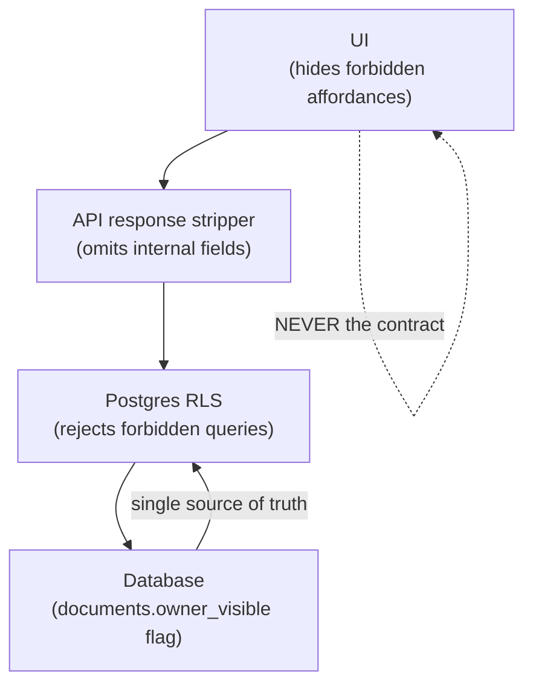

# myaircraft.us Document Persona Architecture — the Iron Wall SOP

**Audience:** every engineer who touches the document model, every QA test that exercises uploads, every compliance auditor evaluating the data classification boundary, every product manager scoping a new document-related feature.

**Why this SOP exists:** the platform stores documents from many sources — owner-uploaded insurance certificates, shop-uploaded mechanic notes, manufacturer-uploaded service bulletins, vendor invoices, scanned logbook pages. WHO can see WHICH document is one of the most consequential security boundaries in the system. Get it wrong once and an owner sees another shop's vendor pricing, or a marketplace buyer sees the seller's internal photos. This SOP defines the contract — what we call the **Iron Wall** — that prevents that.

---

## 1. Executive Summary

Every document in the platform carries a **persona** (who uploaded it) and a **type** (what kind of doc it is). These two fields together determine WHO can see the document and HOW.

The Iron Wall is the rule that the persona × type matrix is the **single source of truth** for visibility. UI hiding is never the contract. RLS at the database layer + response-stripping at the API layer enforce the wall. The UI is the third layer of defense, not the first.

The platform recognizes **3 personas** for documents (`owner`, `shop`, `mechanic`) and **17 document types** (logbook, POH, AFM, maintenance manual, service manual, parts catalog, service bulletin, AD, work order, inspection report, Form 337, STC, Form 8130, lease/ownership, insurance, compliance, miscellaneous). The persona × type matrix has 51 cells. Most cells answer "owner-visible: yes" or "owner-visible: no" — a small number have nuanced behavior (e.g., a logbook entry is owner-visible only after it's been signed).

This SOP is the contract for every cell.

---

## 2. The persona model

| Persona | Who uploads as this | Example documents |
|---|---|---|
| `owner` | The aircraft owner via the portal | Insurance certificate, pilot's medical, registration |
| `shop` | A maintenance shop's admin or service writer | Service bulletins, ADs, parts catalogs, manufacturer manuals, scanned logbook pages |
| `mechanic` | A specific mechanic during a WO | Mechanic photos, internal notes attachments, vendor invoices |

A user's role does NOT automatically determine the upload persona. A shop admin uploading a document might choose `mechanic` persona if it's a WO-attached doc. The upload modal in `apps/web/components/documents/persona-aware-upload-modal.tsx` enforces compatible role × persona combos (see §6).

---

## 3. The document type model

The 17 types live in `apps/web/types/index.ts` as `DocType`:

```
logbook | poh | afm | afm_supplement |
maintenance_manual | service_manual | parts_catalog |
service_bulletin | airworthiness_directive |
work_order | inspection_report |
form_337 | stc | form_8130 |
lease_ownership | insurance | compliance | miscellaneous
```

Each type carries default behaviors — chunking strategy, retention policy, RAG-retrieval default — but **visibility is governed by the persona × type matrix, not the type alone**.

---

## 4. The Iron Wall matrix

```mermaid
flowchart TD
  upload[Upload attempt<br/>file + persona + doc_type]
  rule1{Persona<br/>allowed to upload<br/>this type?}
  reject1[Reject 403<br/>"Not in your scope"]
  store[Store in Supabase Storage<br/>+ documents row]
  rule2{doc_type<br/>owner-visible<br/>by default?}
  ovT[owner_visible = true]
  ovF[owner_visible = false]
  shop[Shop override<br/>can flip either way<br/>before publish]
  rls[RLS at query time:<br/>owner sees only<br/>owner_visible = true]
  rag[RAG retrieval<br/>filters by persona]
  done[Document accessible<br/>per Iron Wall rules]

  upload --> rule1
  rule1 -- no --> reject1
  rule1 -- yes --> store
  store --> rule2
  rule2 -- yes --> ovT
  rule2 -- no --> ovF
  ovT --> shop
  ovF --> shop
  shop --> rls --> rag --> done

  classDef reject fill:#fee2e2,stroke:#dc2626;
  classDef allow fill:#dcfce7,stroke:#16a34a;
  class reject1 reject;
  class done allow;
```

The full persona × type × visibility matrix:

| Doc type | Owner upload allowed | Shop upload allowed | Mechanic upload allowed | Owner-visible by default | Marketplace-listable |
|---|---|---|---|---|---|
| `logbook` (signed) | ❌ | ✅ | ✅ | ✅ (always, after sign) | ✅ |
| `logbook` (draft) | ❌ | ✅ | ✅ | ❌ (until signed) | ❌ |
| `poh` (Pilot Operating Handbook) | ✅ | ✅ | ❌ | ✅ | ✅ |
| `afm` | ✅ | ✅ | ❌ | ✅ | ✅ |
| `afm_supplement` | ✅ | ✅ | ❌ | ✅ | ✅ |
| `maintenance_manual` | ❌ | ✅ | ❌ | ❌ (shop only) | ✅ (licensed) |
| `service_manual` | ❌ | ✅ | ❌ | ❌ | ✅ |
| `parts_catalog` | ❌ | ✅ | ❌ | ❌ | ✅ |
| `service_bulletin` | ❌ | ✅ | ✅ | ✅ | ❌ |
| `airworthiness_directive` | ❌ | ✅ | ✅ | ✅ | ❌ |
| `work_order` (scan) | ❌ | ✅ | ✅ | ✅ (if shop opts in) | ❌ |
| `inspection_report` | ❌ | ✅ | ✅ | ✅ | ❌ |
| `form_337` | ❌ | ✅ | ✅ | ✅ | ❌ |
| `stc` | ✅ | ✅ | ❌ | ✅ | ❌ |
| `form_8130` | ❌ | ✅ | ✅ | ❌ (internal — vendor source) | ❌ |
| `lease_ownership` | ✅ | ✅ | ❌ | ✅ (owner only) | ❌ |
| `insurance` | ✅ | ✅ | ❌ | ✅ (owner only) | ❌ |
| `compliance` (AD-compliance evidence) | ❌ | ✅ | ✅ | ✅ | ❌ |
| `miscellaneous` | ✅ | ✅ | ✅ | ❌ (default; explicitly opt-in) | ❌ |

**"Owner-visible by default"** does NOT mean the owner sees everyone else's data — it's still org-scoped via RLS. It means "for documents on this owner's aircraft, the default visibility is owner-readable."

---

## 5. The four enforcement layers



**The Iron Wall:** UI hiding is convenience. Response stripping is defense. RLS is the contract. The database boolean is the source of truth.

If you write a feature that ONLY hides a field in the UI, you have built nothing.

---

## 6. Upload-time enforcement

The upload modal at `apps/web/components/documents/persona-aware-upload-modal.tsx` is persona-aware. Pseudocode:

```
user.role === 'owner'      → personaForUpload = 'owner'
user.role === 'mechanic'   → personaForUpload = 'mechanic'  (also 'shop' allowed)
user.role === 'lead' | 'ia' | 'admin' → personaForUpload = 'shop' (also 'mechanic' allowed)
```

The modal shows only the **doc types valid for the selected upload persona**. An owner sees POH / AFM / Insurance / Lease / Misc. A mechanic sees Logbook / Compliance / Work Order / Service Bulletin / Form 337 / Form 8130. Etc.

Upload payload includes `uploaded_by_persona`. The API route at `apps/web/app/api/upload/complete/route.ts` re-validates the persona × type combo server-side — UI is the second layer.

---

## 7. The `owner_visible` flag

The `documents.owner_visible` boolean is the operational gate. The default value for each (persona, type) combo is set per §4 above. Shop staff can:

- Toggle `owner_visible=true` on an internal-by-default doc to share it
- Toggle `owner_visible=false` on a normally-visible doc to hide it (rare)

The toggle is logged in `audit_event` with the actor, the prior value, and the reason (optional but encouraged).

**The toggle is enforced at:**
1. The API response — documents with `owner_visible=false` are filtered out of any owner-scoped GET
2. The Supabase RLS policy on `documents` for `auth.role()='owner'` requires `owner_visible=true`
3. The document detail page — re-checks before rendering

---

## 8. RAG-layer enforcement

Document chunks inherit the visibility of their parent document. The `document_chunks` table doesn't carry its own `owner_visible` column — it's joined at retrieval time.

For owner-persona queries (the future `/api/owner/ask` — see SOP-12 §10), the retrieval SQL adds a filter:

```sql
WHERE documents.owner_visible = TRUE
  AND documents.organization_id IN (SELECT … memberships …)
```

This prevents an owner from inadvertently surfacing a chunk that contains internal mechanic notes via an AI query, even if that chunk's embedding happens to match the owner's question.

---

## 9. Marketplace handling

Documents marked **marketplace-listable** in §4 can be exposed in the marketplace surface (SOP-15). The marketplace expands the visibility scope beyond the owner — buyers who don't yet own the aircraft can view listed documents. The Iron Wall must hold here too:

- ONLY docs with `marketplace_visible=true` appear on a marketplace listing
- A separate `marketplace_visible` flag (NOT the same as `owner_visible`) — opt-in by the seller
- Pricing and licensing metadata applies to the file's display, not its raw download
- The download URL is signed per-request and rate-limited

See SOP-15 for the full marketplace contract.

---

## 10. Persona stamps and provenance

Every document row stores:

```
uploaded_by_user_id           → FK to auth.users
uploaded_by_persona           → 'owner' | 'shop' | 'mechanic'
uploaded_by_role              → snapshot of the role at upload
uploaded_at                   → timestamptz
source_provider               → 'manual' | 'gdrive' | 'scanner' | 'api'
source_external_id            → e.g., Google Drive file id
```

The persona stamp is **immutable**. If a user changes role later, the original persona stamp stays. Auditors can reconstruct "who uploaded what under what authority at what time" forever.

---

## 11. Document classification overlay

Independent of the persona × type matrix, every document goes through an **auto-classifier** (see SOP-13 §17 and `apps/web/lib/documents/auto-classify.ts`). The classifier suggests a `doc_type` based on content; the human's upload-time choice wins by default. If the classifier disagrees with the human at high confidence, the document detail UI surfaces an "AI thinks this is a Logbook — switch?" banner (planned — see SOP-13 §17 gap list).

The classifier does NOT change the **persona** — only the type.

---

## 12. Acceptance criteria

1. Every `documents` row has `uploaded_by_persona` populated.
2. RLS on `documents` enforces `owner_visible=true` for `role='owner'` queries.
3. The upload modal hides doc types incompatible with the selected upload persona.
4. The API rejects an upload payload with a persona × type combination not allowed by §4.
5. Toggling `owner_visible` writes an `audit_event` row with actor + prior value.
6. The marketplace surface filters by a SEPARATE `marketplace_visible` flag, never by `owner_visible`.
7. Re-uploading the same content does not duplicate the doc row (dedupe via SHA-256 hash + org scope).
8. The RAG retrieval filter for owner-persona queries adds `WHERE owner_visible=true`.
9. The doc's `uploaded_by_persona` is immutable post-creation — UPDATE statements that change it are rejected by an enforcement trigger.
10. Persona stamps survive role changes — an owner who later joins the shop as a mechanic does not retroactively change their old uploads.

---

## 13. References

- SOP-12 §5 — Owner-visible field matrix (downstream consumption)
- SOP-13 §13 — Data security; Iron Wall is part of the SOC2 confidentiality story
- SOP-15 — Marketplace (related visibility flag, distinct scope)
- `apps/web/components/documents/persona-aware-upload-modal.tsx`
- `apps/web/lib/documents/persona-scope.ts` — `personaCanUpload()` enforcement helper
- `apps/web/lib/documents/auto-classify.ts` — type classifier overlay
- 14 CFR §43.9 / §43.11 / §91.417 — recordkeeping requirements

---

**Document control:**
- SOP ID: SOP-14
- Version: 1.0.0
- Status: active
- Last updated: 2026-05-21
- Authors: Claude (Opus 4.7) — derived from `SOP-DOC-001_Document_Persona_Architecture.docx` + codebase enforcement helpers
- Next review: 2026-08-21
