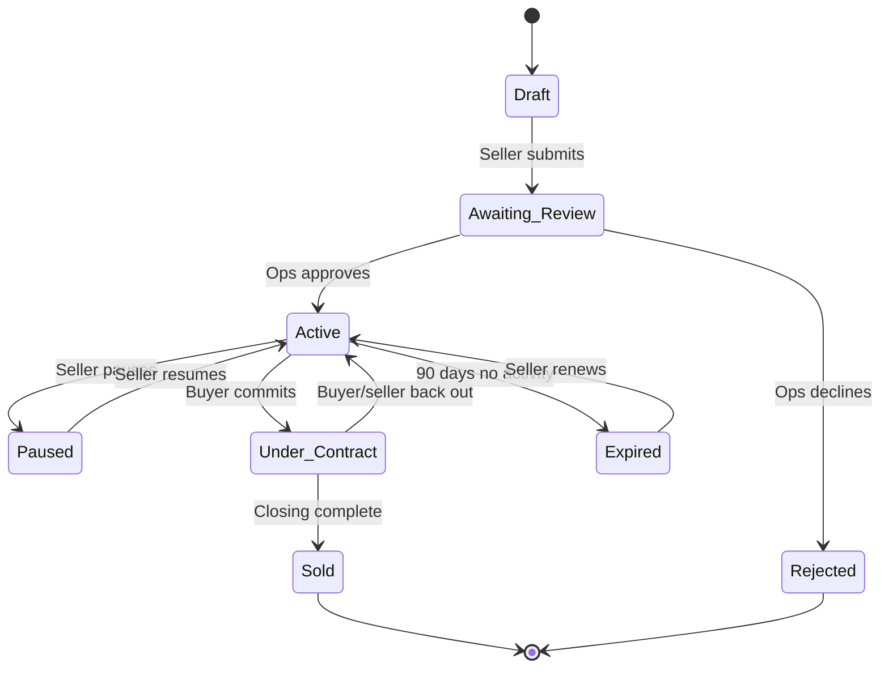
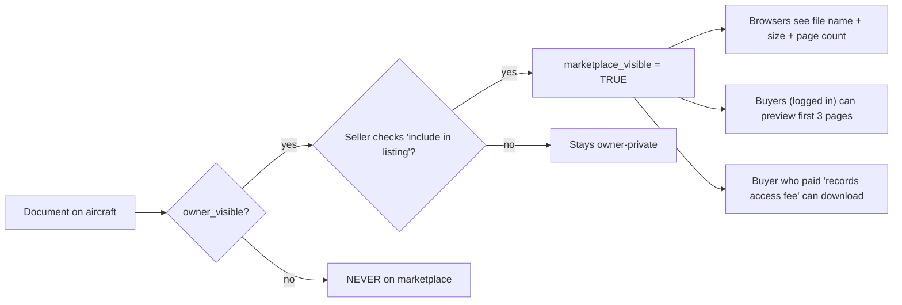
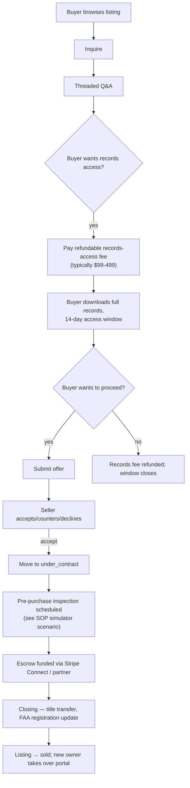

# myaircraft.us Marketplace — SOP and Product Specification

**Audience:** product, engineering, compliance/legal, and the marketplace operations team.
**Status:** DRAFT — the marketplace UI exists in scaffolded form but the workflows below describe the v1 contract before launch. Sections explicitly marked "planned" are unbuilt.

---

## 1. Executive Summary

The myaircraft.us Marketplace turns the platform's most valuable asset — the curated, AI-indexed maintenance history per aircraft — into a transactable surface. Three participant types:

- **Sellers** — aircraft owners listing their plane for sale, OR shops listing manuals/parts they want to monetize
- **Buyers** — prospective owners, brokers, and other shops
- **Browsers** — anyone (logged-in or not) who's just looking

The marketplace MUST be a **trust layer** first. The single most valuable proof we can offer a buyer is "this aircraft's records are continuously maintained and indexed by myaircraft.us; here is the AI-summarized service history, and here are the actual signed logbook entries you can download." That value proposition is unique to us — Trade-A-Plane and Controller can't show indexed records because they don't HAVE the records.

This SOP defines the contract for that trust layer plus the operational mechanics of listing, buyer messaging, document scope, payment, and escrow handoff.

---

## 2. Participant model

### 2.1 Sellers

A seller is one of:

- **Owner-seller** — the aircraft's registered owner (one or many — see SOP-12 for the multi-owner model)
- **Shop-seller** — a maintenance shop selling on behalf of the owner (consignment), OR selling shop assets (excess inventory, old manuals)
- **Broker** — a third-party intermediary representing the owner (planned for v1.1)

Each seller persona has a corresponding upload + listing flow in the marketplace UI.

### 2.2 Buyers

A buyer is any authenticated portal user. To **inquire** a buyer needs an account (email-verified). To **transact** a buyer needs payment-method on file. Anonymous browsing is allowed for listing-level details; document access requires an account.

### 2.3 Browsers

Anyone with the URL. They see listing summary cards, photos, headline specs, and the AI-summarized service history. They cannot download documents or message the seller without registering.

---

## 3. Listing lifecycle



| State | Visible to | Notes |
|---|---|---|
| `draft` | Seller only | Seller is still editing |
| `awaiting_review` | Seller + ops | Ops verifies aircraft identity, document completeness, legal terms |
| `active` | Public (browsers) + buyers | The standard listed state |
| `paused` | Seller only | Temporarily hidden — kept seller-side |
| `under_contract` | Public (shown as "under contract" but full details hidden); seller + buyer party | Buyer has committed; in escrow window |
| `sold` | Public (archive only) | Transferred ownership |
| `expired` | Seller only — prompt to renew | Auto-archived after 90 days inactive |
| `rejected` | Seller only — with ops note | Seller can resubmit after addressing concerns |

---

## 4. Listing data model

```sql
CREATE TABLE marketplace_listings (
  id                  UUID PRIMARY KEY DEFAULT gen_random_uuid(),
  aircraft_id         UUID NOT NULL REFERENCES aircraft(id),
  seller_user_id      UUID NOT NULL REFERENCES auth.users(id),
  seller_org_id       UUID REFERENCES organizations(id),
  seller_role         TEXT NOT NULL,                              -- 'owner' | 'shop' | 'broker'
  state               TEXT NOT NULL DEFAULT 'draft',              -- see lifecycle §3
  asking_price_cents  BIGINT,
  currency            TEXT NOT NULL DEFAULT 'USD',
  headline            TEXT NOT NULL,
  description         TEXT,                                       -- markdown
  location            TEXT,                                       -- "KOSH, WI" or owner-stated
  hangared            BOOLEAN,
  total_time_hours    NUMERIC(10,1),
  smoh_hours          NUMERIC(10,1),
  annual_due          DATE,
  views_count         INTEGER NOT NULL DEFAULT 0,
  inquiries_count     INTEGER NOT NULL DEFAULT 0,
  documents_attached  INTEGER NOT NULL DEFAULT 0,
  ai_summary          TEXT,                                       -- auto-generated, see §6
  ai_summary_at       TIMESTAMPTZ,
  listed_at           TIMESTAMPTZ,
  expires_at          TIMESTAMPTZ,
  reviewed_by_user_id UUID,
  reviewed_at         TIMESTAMPTZ,
  review_notes        TEXT,
  created_at          TIMESTAMPTZ NOT NULL DEFAULT NOW(),
  updated_at          TIMESTAMPTZ NOT NULL DEFAULT NOW()
);

CREATE INDEX idx_listings_state_listed ON marketplace_listings(state, listed_at DESC) WHERE state = 'active';
CREATE INDEX idx_listings_aircraft     ON marketplace_listings(aircraft_id);
```

---

## 5. Document scope on a listing

Documents are exposed to the marketplace via a SEPARATE `marketplace_visible` flag on the `documents` table (NOT `owner_visible`). See SOP-14 for the Iron Wall reasoning.



### 5.1 The progressive disclosure ladder

| Viewer | Sees |
|---|---|
| Anonymous browser | Listing summary + photos + AI summary + count of attached docs |
| Logged-in non-buyer | Same as anonymous + can submit an inquiry |
| Buyer who paid records-access fee (escrowed, refundable if no sale) | Full document downloads (logbooks, AD compliance, etc.) for 14 days |
| Buyer under contract | Full document downloads indefinitely once sale is closing |
| Closed buyer | Becomes the aircraft's new owner; full owner-portal access transitions |

### 5.2 What can NEVER appear on the marketplace

- Internal mechanic notes
- Vendor invoices / cost basis
- Other customers' aircraft (RLS prevents)
- Draft / unsigned logbook entries
- Documents whose `owner_visible=false`
- PII beyond what the seller explicitly chose to include in the public listing

These prohibitions are enforced at the database / API layer per the Iron Wall (SOP-14 §5).

---

## 6. AI-generated summary

When a listing moves to `active`, a background job generates an `ai_summary` for the listing using GPT-4o against the aircraft's owner-visible records:

```
"N401LP is a 2003 Cessna 172S Skyhawk SP with 1,832 total time hours.
Annual inspection completed June 2025; next due June 2026. Engine
overhauled in 2019 (SMOH 387 hours). No active ADs outstanding. The
service history shows continuous maintenance at one shop since 2018,
with regular oil changes and timely AD compliance. Most recent
significant work: brake replacement in April 2026."
```

The summary is:

- Generated from the aircraft's `documents` + `maintenance_events` + `logbook_entries`
- Owner-visible only (subject to Iron Wall)
- Reviewed by the seller before going live (defense against AI errors)
- Refreshed nightly while the listing is `active`
- Falls back to a manual seller-written summary if AI is unavailable

The AI summary is the **trust-layer headline** — the thing no competitor can replicate without our indexed records.

---

## 7. Buyer ↔ seller messaging

When a buyer inquires:

1. A `marketplace_thread` row is created keyed to the listing + buyer
2. Email notification to the seller
3. Both parties can post messages
4. Optional templated replies for sellers ("What's the asking price firm at?")
5. Shop-sellers can route to the shop's `/messages` inbox if configured

Messaging UI is similar to the owner-portal threads (SOP-12 §9) — same data model pattern, distinct RLS scope.

### 7.1 Privacy in messaging

- Buyer's identity is initially **anonymized** (display name "Buyer #1234") until they explicitly reveal it
- Seller's identity is shown by default (it's a listing)
- Phone numbers and physical addresses are exchanged only via the "request contact" affordance, which audits the disclosure

---

## 8. Inquiry → offer → escrow → close flow



### 8.1 Escrow

For v1 we partner with an external escrow service (TBD — AeroSpace Reports, EscrowMyAircraft, or a Stripe Connect-mediated flow). The platform does NOT hold buyer funds directly. Escrow status is captured as a state on the listing for reference but ground truth lives with the escrow partner.

### 8.2 Title transfer

The FAA Aircraft Registry handles ownership transfer. The platform supports this by:

- Generating a bill-of-sale template
- Tracking the AC Form 8050-2 submission
- Coordinating the prior-owner's de-registration with the new-owner's onboarding (SOP-12 §3)

---

## 9. Pricing & fees

| Fee | Amount (v1) | Charged to | Notes |
|---|---|---|---|
| Standard listing | Free | Seller | All sellers get free listing |
| Featured listing | $49 / month | Seller | Pinned to top of category |
| Records-access fee | $99–499 (seller-configurable) | Buyer | Refundable if no sale within 14 days |
| Closing facilitation | 1.5% of sale price (cap $5,000) | Seller | Optional; only if the platform facilitates escrow + title |
| Premium analytics | $19 / month | Seller | View counts, inquiry funnel, comparable listings |

Pricing is configurable and may change. The contract this SOP holds is the structure, not the numbers.

---

## 10. Permissions matrix (marketplace-specific)

| Action | Browser | Buyer | Records-paid Buyer | Buyer under contract | Seller | Ops admin |
|---|---|---|---|---|---|---|
| View listing summary | ✅ | ✅ | ✅ | ✅ | ✅ | ✅ |
| View AI summary | ✅ | ✅ | ✅ | ✅ | ✅ | ✅ |
| View photos | ✅ | ✅ | ✅ | ✅ | ✅ | ✅ |
| See document file names | ✅ | ✅ | ✅ | ✅ | ✅ | ✅ |
| Preview first 3 pages of a doc | ❌ | ✅ | ✅ | ✅ | ✅ | ✅ |
| Download docs | ❌ | ❌ | ✅ (14-day window) | ✅ (during contract) | ✅ | ✅ |
| Send inquiry | ❌ | ✅ | ✅ | ✅ | n/a | ✅ |
| Submit offer | ❌ | ✅ | ✅ | n/a | n/a | ✅ |
| Edit listing | ❌ | ❌ | ❌ | ❌ | ✅ (their own) | ✅ |
| Approve listing for `active` | ❌ | ❌ | ❌ | ❌ | ❌ | ✅ |
| Reject listing | ❌ | ❌ | ❌ | ❌ | ❌ | ✅ |
| Force-pause a listing (compliance) | ❌ | ❌ | ❌ | ❌ | ❌ | ✅ |

---

## 11. Compliance considerations

### 11.1 FAA aircraft registry

The platform does NOT replace the FAA's aircraft registry. Title transfer happens at the FAA, not in our database. Our role is **facilitative** — generate templates, track submission status, coordinate handoff. Misrepresenting our role here is a serious legal risk.

### 11.2 14 CFR §91.417 — Recordkeeping

When ownership transfers, the prior owner must deliver the maintenance records to the new owner (§91.417(b)(2)). The platform satisfies this by enabling the new owner to take over the aircraft's record set in their portal at closing — the records don't move, the portal access does.

### 11.3 Misrepresentation prevention

Listings MUST display:

- The aircraft's identity (tail number, make/model) verified against the FAA Registry
- The seller's role (owner / shop / broker)
- The age of the most recent annual inspection
- A disclaimer that the platform's records reflect what's been uploaded, not necessarily complete history

The AI summary MUST NOT make claims of completeness it cannot back up. The auto-prompt explicitly instructs: "If gaps in the records are evident, state them."

### 11.4 Anti-discrimination

The marketplace MUST NOT enable filters that would constitute prohibited discrimination (e.g., "show me only listings from sellers in this protected class"). All filters are aircraft-attribute-based (make/model/year/hours/price), not seller-identity-based.

---

## 12. Acceptance criteria

1. A seller can create a listing in `draft` state.
2. Submitting a listing for review moves it to `awaiting_review`.
3. Ops can approve a listing → `active`.
4. An anonymous browser can view an `active` listing's summary + photos + AI summary.
5. An anonymous browser CANNOT download any document.
6. A logged-in non-buyer can submit an inquiry; the seller receives a notification.
7. A buyer who pays the records-access fee gets 14-day download access; access auto-expires.
8. The records-access fee is refunded if no offer is submitted within 14 days.
9. A document with `owner_visible=false` is NEVER exposed on a marketplace listing, regardless of the seller's listing actions.
10. The AI summary is regenerated nightly while the listing is `active`.
11. The AI summary is not displayed live until the seller has reviewed it.
12. Transitioning a listing to `under_contract` hides full details from the public view; only the listing summary + "under contract" badge shows.
13. A listing in `under_contract` cannot accept additional offers.
14. Closing a sale (state → `sold`) automatically initiates owner-portal handoff per SOP-12 §3.
15. The marketplace SEPARATELY tracks `marketplace_visible` on documents — toggling `owner_visible` does NOT automatically toggle `marketplace_visible`.
16. Listing expiry auto-fires at 90 days idle.
17. RLS on `marketplace_listings`, `marketplace_threads`, `marketplace_thread_messages` enforces org + buyer scope correctly.

---

## 13. Gap analysis (what's planned, what's built)

| Feature | State | Files / next step |
|---|---|---|
| Marketplace UI page (`/marketplace`) | ✅ Scaffolded | `app/(app)/marketplace/page.tsx` |
| Marketplace listing API | ⚠ Partial | `app/api/marketplace/listings/route.ts` (read only) |
| Listing creation flow | ❌ Not built | `app/(app)/marketplace/new/` |
| Document marketplace_visible toggle | ❌ Not built | `documents` migration + UI in document detail |
| AI summary background job | ❌ Not built | `app/api/cron/marketplace-summaries/route.ts` (planned) |
| Buyer messaging threads | ❌ Not built | Mirror of `owner_communication_thread` |
| Records-access fee payment | ❌ Not built | Stripe one-time charge + refund flow |
| Offer submission + accept/decline | ❌ Not built | New API surface |
| Escrow handoff | ❌ Not built (partner TBD) | Out-of-platform; we just track state |
| Title transfer template | ❌ Not built | PDF generation from template |
| Ops admin review queue | ❌ Not built | `/admin/marketplace/review` |
| Featured-listing payments | ❌ Not built | Stripe subscription product |

---

## 14. References

- SOP-12 §3 — Owner onboarding (used at closing handoff)
- SOP-14 §5 + §9 — Iron Wall + marketplace document scope
- SOP-13 §13 — Encryption and data isolation
- 14 CFR §91.417 — Recordkeeping requirements at ownership transfer
- AC Form 8050-2 (FAA Aircraft Bill of Sale)

---

**Document control:**
- SOP ID: SOP-15
- Version: 1.0.0
- Status: draft (spec ahead of implementation; mark `active` once Section 13 gap list is closed)
- Last updated: 2026-05-21
- Authors: Claude (Opus 4.7) — derived from `SOP-MKT-001_Marketplace.docx` + platform conventions
- Next review: 2026-08-21
