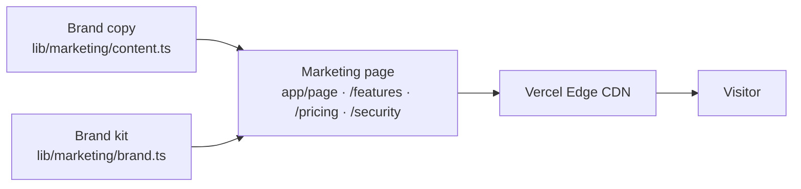

# SOP-16 — Marketing & Public Website

## 1. Purpose

This SOP defines what the public-facing surface of myaircraft.us is for,
what it must say, who owns the copy and the brand, and how a marketing
change makes it to production safely.

The "public surface" is everything anyone can reach without logging in:
the marketing site (`/`, `/features`, `/pricing`, `/about`, `/terms`,
`/security`, `/scanning`), public handles (`/owner/[handle]`,
`/mechanic/[handle]`), and the SEO surface (`robots.txt`, `sitemap.xml`,
the og-image renderer).

## 2. Audience and personas

| Visitor | Where they land | What we want them to do |
|---|---|---|
| Aircraft owner | `/` or `/owner/[handle]` from a Google search | Understand "this is where my logbook lives now," click **Get Started**, end up at signup |
| Shop owner | `/features` or `/pricing` from an AOPA / type-club referral | Read the shop-side narrative, book a demo or start a trial |
| Investor / press | `/about` or `/security` from a warm intro | Get to `/investor-room` (admin-gated; live link sent personally) |
| FAA / auditor | `/security`, `/terms` | Confirm posture; reach us via the published security mailbox |
| Buyer in a marketplace transaction | A specific `/marketplace/[slug]` listing | Open the listing, request the records packet, pay the access fee |

## 3. Source-of-truth rule



**Every public-facing text string lives in `lib/marketing/content.ts` or a
brand-kit override.** A page file may not contain hardcoded headlines or
tagline strings — only structural markup that consumes the content
module. This lets us swap brand copy without touching React.

The brand kit (`lib/marketing/brand.ts`) defines colors, logos, OEM
partner marks, and the canonical metadata block. It is the only place
that should ever hardcode hex values.

## 4. Information architecture

The public site has nine top-level surfaces:

- `/` — homepage, the front door
- `/features` — long-form feature breakdown
- `/pricing` — tiers + per-aircraft pricing table
- `/scanning` — on-site digitization service (free / insured)
- `/about` — company narrative and team
- `/security` — security & compliance posture (public version of SOP-13 §15)
- `/terms` — Terms of Service
- `/legal/privacy` — Privacy Policy
- `/owner/[handle]` — public-facing handle pages for aircraft owners
- `/mechanic/[handle]` — public-facing handle pages for mechanics

In-app and admin surfaces (`/dashboard`, `/admin/*`, `/sop-library`,
`/investor-room`) are NOT part of the public surface and must not be
indexed by search engines.

## 5. Brand guidelines

| Element | Spec | Source of truth |
|---|---|---|
| Primary brand color | `#2563EB` (myaircraft blue) | `lib/marketing/brand.ts` |
| Trust / compliance accent | Emerald 600–700 | `lib/marketing/brand.ts` |
| Logotype | "myaircraft.us" — lowercase, single word, no space | Hard rule |
| Wordmark file | `/components/marketing/brand/BrandLogos.tsx` | Code |
| OEM partner logos | Inline SVGs in `/components/redesign/integrations/logos/` | Code |
| Favicon + og-image | `app/icon.tsx`, `app/opengraph-image.tsx` | Code |
| Voice | "Confident, technical, honest. No marketing fog." | This SOP |

**Voice rules:**
- "We do not pretend a breach is impossible — we pretend we're ready when one happens." (Public-facing example.)
- Numbers are real or clearly flagged as "target / projected." Never imply traction we don't have.
- Avoid words: "revolutionary", "disrupt", "synergy", "leverage" (as a verb), "best-in-class".
- Prefer: short sentences, specific verbs, named regulations (14 CFR §43, not "FAA rules").

## 6. SEO and metadata

Every public page must export a Next.js `Metadata` object via the App
Router pattern:

```ts
export const metadata: Metadata = {
  title: '<Page name> · aircraft.us',
  description: '<≤155 chars, action-oriented>',
  alternates: { canonical: 'https://www.myaircraft.us/<path>' },
}
```

- Open Graph image: `/app/opengraph-image.tsx` renders a Vercel-OG card with the page title + brand mark.
- `robots.txt` allows `/, /features, /pricing, /security, /about, /scanning, /terms, /legal/*, /owner/*, /mechanic/*` and disallows everything else.
- `sitemap.xml` lists only the public set.
- Structured data: Organization + WebSite JSON-LD on the homepage.

## 7. Acceptance criteria

A marketing change is "done" only if:

- [ ] Copy lives in `lib/marketing/content.ts`, not hardcoded in JSX.
- [ ] Brand colors come from `brand.ts`, not arbitrary hex.
- [ ] Mobile breakpoint (`sm:` / `md:`) is tested at 375 px and 768 px.
- [ ] Lighthouse score ≥ 90 on Performance, Accessibility, Best Practices, SEO.
- [ ] All external links use `target="_blank" rel="noopener noreferrer"`.
- [ ] No public link points to an admin-only route (the investor-room and SOP-library links are reachable only from authenticated admin nav).
- [ ] The page renders an honest `canonical` URL and og-image.
- [ ] `next build` succeeds with no new warnings.

## 8. Investor Room — admin-only entry

The Investor Room is `/investor-room` (admin-gated) plus the
full-screen presenter at `/investor-pitch-present`. There is no public
link to either route. Investors are sent a personal link by the
founder; the page checks `is_platform_admin` server-side on every
render.

The "Press / Investors" link on `/about` opens a mailto rather than a
deep-link to the room.

## 9. Brand assets

| Asset | Location | Notes |
|---|---|---|
| Wordmark (SVG) | `components/marketing/brand/BrandLogos.tsx` | Tints via `currentColor` |
| Favicon | `app/icon.tsx` | Auto-resized by Next.js |
| Open-graph cards | `app/opengraph-image.tsx`, per-route variants | Vercel-OG |
| Demo screenshots | `public/screens/*.png` | Sourced from /demo persona |
| Partner / OEM logos | `components/redesign/integrations/logos/` | Inline SVG, no PNGs |

## 10. Owning the change

| Change type | Owner | Review |
|---|---|---|
| Copy on `/`, `/features`, `/pricing` | Founder | Self-review + Lighthouse run |
| `/security`, `/terms`, `/legal/privacy` | Founder + advisor (legal) | Audit log of edits |
| Brand color or wordmark | Founder | Brand-kit migration commit |
| New marketing page | Founder | Add to `robots.txt` + `sitemap.xml` |

## 11. References

- SOP-13 — full-stack architecture (deployment, routing).
- SOP-14 — document-persona architecture (what the public can see).
- SOP-15 — marketplace (public listings).
- `/security` — the public-facing companion document.
