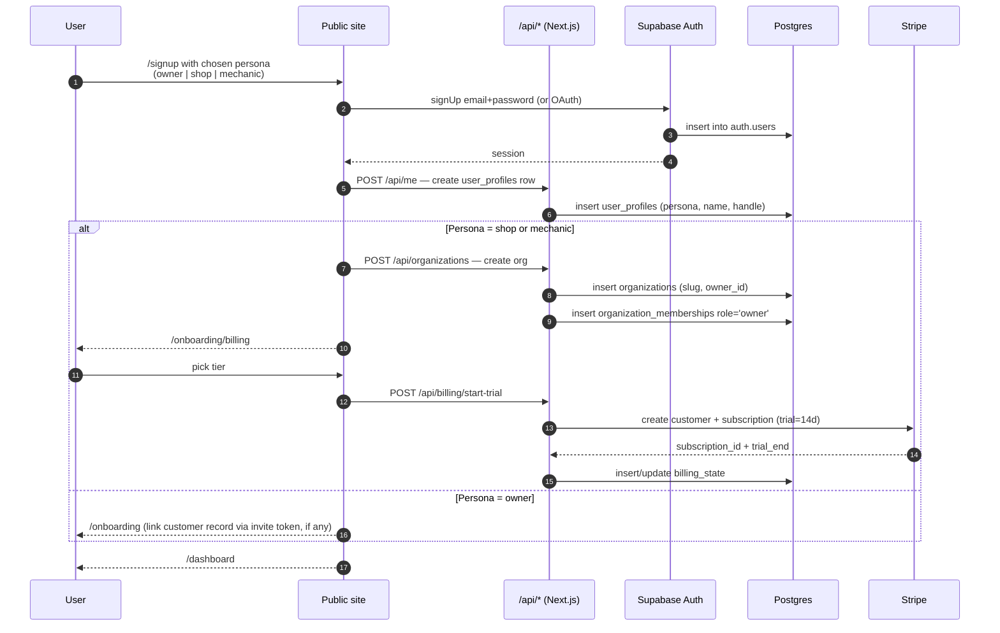
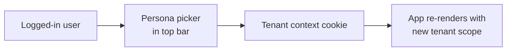

# SOP-17 — Onboarding & Billing

## 1. Purpose

End-to-end contract for everything that happens between "a user types
myaircraft.us into the address bar" and "their first paid month
renews." Covers persona-aware signup, tenant creation, trial start,
billing surface, paywall, and persona switches.

## 2. Signup → Tenant flow

## 3. Persona model

| Persona | Where they start | Default tenant | Billing |
|---|---|---|---|
| `shop` | `/signup?persona=shop` | New organization, slug auto-generated | Per-aircraft tier; 14-day trial |
| `mechanic` | `/signup?persona=mechanic` (invite-only) | Joined to an existing org via invite | Bundled with shop ACV |
| `owner` | `/signup?persona=owner` | No org of their own; linked to one+ customers via portal_user_id | Free to the owner |

Self-serve `shop` signup is allowed. Self-serve `mechanic` signup is
not — mechanics are always invited via a magic link issued by a shop
admin (see SOP-10 §4).

## 4. Trial → Paid

Trial is **14 days**. The platform shows a non-blocking banner from
day 0; on day 10 the banner becomes amber; on day 14 the paywall
activates and gates write actions (work orders, invoices, logbook
signing). Read actions remain available so the user can export their
data.

The paywall:

- Live at `/onboarding/billing`
- Pulls tier definitions from `lib/billing/products.ts` (server) /
  `products.client.ts` (client)
- Renders the Stripe Payment Element in-line; no Stripe-hosted Checkout
- On success, writes to `billing_state` table + invalidates the in-app cache

## 5. Pricing & tiers

The canonical tiers live in `lib/billing/products.ts`:

| Tier | Price | Cap | Audience |
|---|---|---|---|
| Solo | $99/mo | 1 aircraft | Hobbyists |
| Shop Starter | $299/mo | 5 aircraft | New shops |
| Shop Pro | $899/mo | 20 aircraft | Established SMB shops |
| Shop Unlimited | $1,999/mo | Unlimited | Large SMB / multi-location |

Add-ons:
- Marketplace listing — 2.5% take rate on sale, $0 listing fee
- Records-access fee — $99 per buyer pull (split: $79 shop / $20 platform)
- White-label tier — annual contract, custom pricing

## 6. Per-persona entitlements

Per migration `058_per_persona_entitlements.sql` the platform supports
fine-grained entitlements (e.g., a user can be a shop admin AND an
owner of their own aircraft on a different tenant). Entitlements are
resolved server-side in `lib/billing/gate.ts` on every gated route.

## 7. Persona switching

A user with multiple personas (owner of their own aircraft + employee
of a shop) sees a persona picker in the top bar. Switching personas
rewrites the tenant slug in the URL and refreshes the session's
organization context.

## 8. Cancellation & refunds

- Self-serve cancellation via `/settings/billing` → "Cancel subscription".
- Cancellation is immediate at end of current period (no refund of remaining time).
- Mid-cycle refunds are allowed only by founder approval; ticket logged in `audit_event`.
- Cancelled accounts retain read-only access for 30 days; hard-delete after that (see SOP-12 §11.3 for data-rights flow).

## 9. Anti-abuse

- One trial per Stripe customer (matched on email + payment method).
- Trial requires a payment method on file (no plain-email trials).
- Repeat-signup attempts from the same fingerprint hit a soft rate limit and a CAPTCHA challenge.
- Marketplace-only accounts (no shop or owner persona) cannot create work orders.

## 10. Acceptance criteria

- [ ] `/signup?persona=...` routes to the right onboarding flow.
- [ ] Trial start writes a `billing_state` row and a `subscriptions` Stripe object.
- [ ] Paywall activates exactly on day 14 (server-side check, not client clock).
- [ ] Cancelling preserves read-only access for 30 days.
- [ ] Persona switcher rewrites the URL and rehydrates the tenant context.
- [ ] All billing-related routes log to `audit_event`.

## 11. References

- SOP-10 §4 — mechanic onboarding (invite-only).
- SOP-12 §3 — owner onboarding.
- SOP-13 §10 — API design & security.
- `lib/billing/*` — billing implementation.
- `supabase/migrations/058_per_persona_entitlements.sql`.
