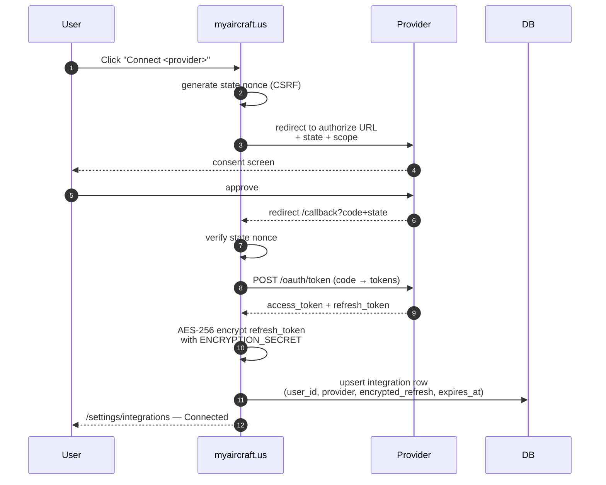

# SOP-18 — Integrations & Webhooks

## 1. Purpose

myaircraft.us integrates with five external systems today and is
architected to add more without rewriting the surrounding code. This
SOP defines the integration contract — how OAuth flows are wired, how
webhooks are verified, how cron jobs run, and how we keep secrets out
of the browser bundle.

## 2. The integrations

| Provider | Surface | Type | Live? |
|---|---|---|---|
| Stripe | Billing, marketplace, payouts | Webhook + API | Yes |
| Supabase | Auth, DB, storage | Direct (no webhook) | Yes |
| Google Document AI | OCR | API only | Yes |
| OpenAI | Embeddings + GPT-4o | API only | Yes |
| Cohere | Rerank v3.5 | API only | Yes |
| Google Drive | Document import | OAuth + API | Yes |
| QuickBooks Online | Accounting export | OAuth + API | Scaffolded |
| FreshBooks | Accounting export | OAuth + API | Scaffolded |
| Anthropic | (planned — model swap) | API only | Code-ready |

## 3. OAuth contract



### 3.1 State nonce
- Stored in a short-lived HttpOnly cookie scoped to `/api/<provider>/*`.
- Validated on callback before any token exchange.
- Single-use; the cookie is cleared after validation.

### 3.2 Token storage
- `access_token` is never stored. We re-fetch with the refresh token when needed.
- `refresh_token` is AES-256-GCM encrypted with `ENCRYPTION_SECRET` and stored in an `integrations` row keyed by `(user_id, provider)`.
- The encryption key is server-only. It NEVER appears in the browser bundle.

### 3.3 Scope minimization
- Google Drive: `drive.readonly` only (PDF imports).
- QuickBooks: `com.intuit.quickbooks.accounting` only.
- FreshBooks: `read+write` on `invoices` only (no payroll, no expenses).
- Each provider's connect button announces the scopes before redirecting.

## 4. Webhook contract

```mermaid
flowchart LR
  ext[External provider<br/>Stripe / etc.]
  edge[Vercel edge]
  fn[/api/webhooks/provider/route.ts]
  verify[Signature check]
  idem[Idempotency check]
  handler[Provider-specific handler]
  db[(Postgres)]
  log[audit_event row]

  ext --> edge --> fn --> verify --> idem --> handler --> db
  handler --> log
```

### 4.1 Signature verification (mandatory)
- Every webhook route MUST verify the provider's signature on the raw request body.
- For Stripe: `stripe.webhooks.constructEvent(rawBody, signature, STRIPE_WEBHOOK_SECRET)`.
- Signature failure → respond 400 immediately, NEVER process the event.
- Routes that don't verify signatures are a P0 vulnerability and a release-block.

### 4.2 Idempotency
- Every webhook event has a provider event id (Stripe `evt_xxx`).
- Before processing, the handler inserts into `webhook_events` with a unique constraint on `(provider, event_id)`.
- On unique-violation: respond 200 (provider sees success) and skip processing.

### 4.3 Replay window
- Reject webhooks older than 5 minutes by the timestamp in the signature header.
- This prevents replay attacks even if a signature were ever leaked.

## 5. Cron contract

Long-running periodic work runs as Vercel Cron jobs (Fluid Compute,
region iad1). Each cron is gated by a shared-secret header.

```ts
// Pattern — every cron route MUST do this
export async function POST(req: NextRequest) {
  const auth = req.headers.get('authorization')
  if (auth !== `Bearer ${process.env.CRON_SECRET}`) {
    return new Response('unauthorized', { status: 401 })
  }
  // ... work
}
```

Current crons:

| Path | Schedule | Purpose |
|---|---|---|
| `/api/cron/document-ingest` | every 5 min | Pick up uploaded docs, run the 9-stage pipeline |
| `/api/cron/telemetry-inference` | hourly | Refresh derived analytics tables |
| `/api/cron/trash-purge` | daily 0300 UTC | Hard-delete trash rows older than 30 days |
| `/api/cron/vision-dispatch-sweep` | every 15 min | Pick up vision-OCR retries |

## 6. Rate limiting

Outbound calls to external providers are wrapped in a per-provider
backoff:
- Cohere rerank: 1-retry on 429 / 5xx with 350 ms delay (see SOP-13 §8).
- OpenAI: exponential backoff via the official SDK retry layer.
- Stripe: idempotency-key on every write; safe to retry.
- Google DocAI: per-doc concurrency cap of 4 (process-wide).

## 7. Secret management

Every secret lives in Vercel Environment Variables (Production / Preview /
Development). Mirrored in `.env.local.example` with placeholder values
checked into the repo.

**Secrets that must never leak to the browser bundle:**
- `STRIPE_SECRET_KEY`, `STRIPE_WEBHOOK_SECRET`
- `OPENAI_API_KEY`, `COHERE_API_KEY`, `ANTHROPIC_API_KEY`
- `GOOGLE_CLIENT_SECRET`, `QUICKBOOKS_CLIENT_SECRET`, `FRESHBOOKS_CLIENT_SECRET`
- `ENCRYPTION_SECRET`, `CRON_SECRET`
- `SUPABASE_SERVICE_ROLE_KEY`

**Publishable keys (safe to ship to the browser):**
- `NEXT_PUBLIC_SUPABASE_URL`, `NEXT_PUBLIC_SUPABASE_ANON_KEY`
- `NEXT_PUBLIC_STRIPE_PUBLISHABLE_KEY`
- `NEXT_PUBLIC_SENTRY_DSN`, `NEXT_PUBLIC_POSTHOG_KEY`

A pre-deploy check greps the built bundle for any `*_SECRET` or
`*_API_KEY` string and fails the deploy if one is found.

## 8. Acceptance criteria

A new integration is "live" only if:

- [ ] OAuth callback verifies the state nonce.
- [ ] Refresh tokens are AES-256 encrypted before DB write.
- [ ] Webhook route verifies the signature on the raw body, BEFORE parsing.
- [ ] Idempotency table (`webhook_events`) is populated on first receipt.
- [ ] Cron routes check `CRON_SECRET` and return 401 without it.
- [ ] No secret appears in the client bundle (pre-deploy grep passes).
- [ ] Provider connection state surfaces in `/settings/integrations`.
- [ ] Disconnect flow revokes the token at the provider AND deletes the local row.

## 9. References

- SOP-13 §10 — API design and security.
- SOP-13 §13 — data security and encryption.
- `apps/web/INTEGRATIONS_SETUP.md` — partner credentials checklist.
- `apps/web/STRIPE_SETUP.md` — Stripe-specific wiring.
- `lib/billing/*`, `lib/integrations/*` — implementation.
